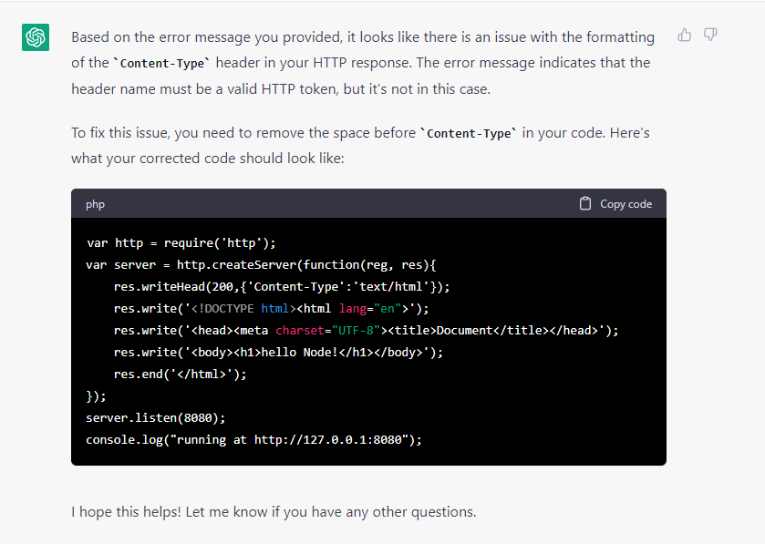
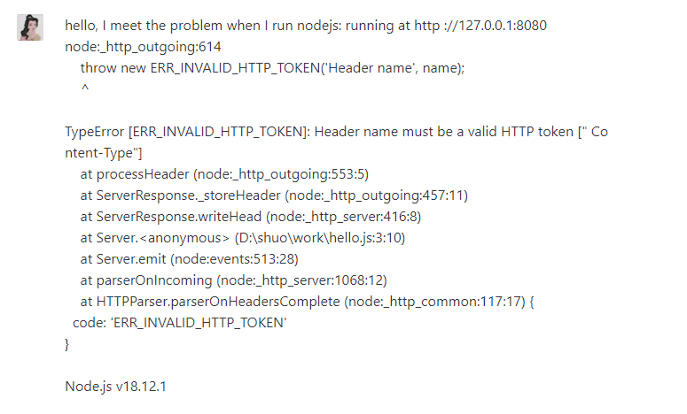
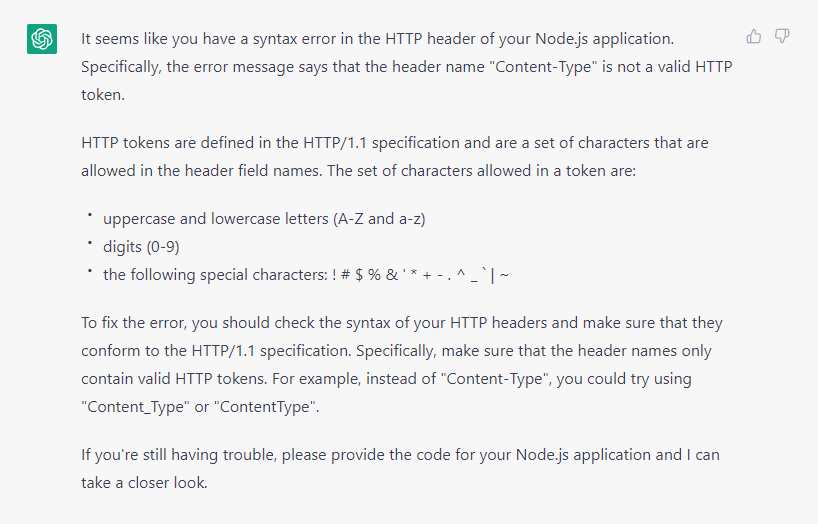
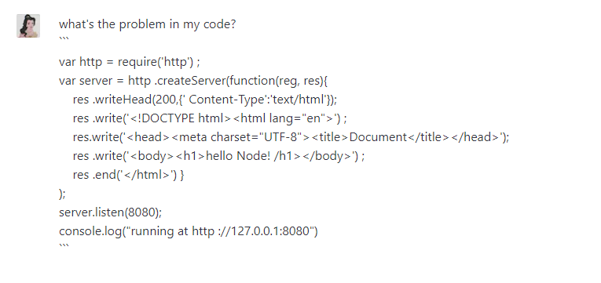
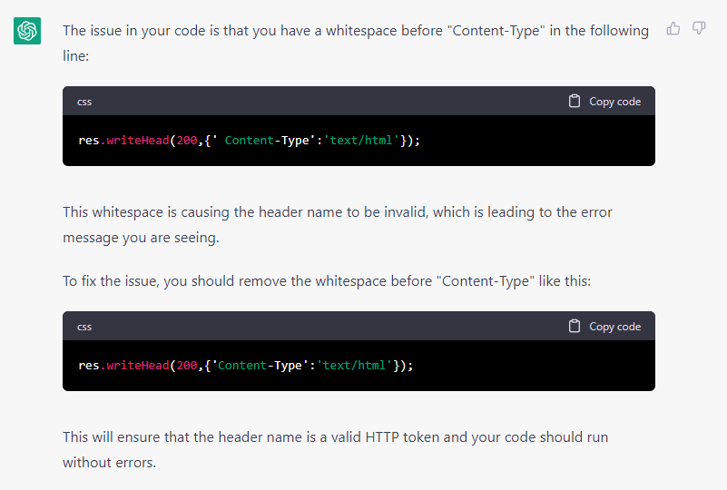

# Tell ChatGPT help you debug
The information must include:

> What is the expected behavior of your code, and what is actually happening?

> What programming language are you using?
> What steps have you taken to try to debug the issue?

> Can you provide a code snippet or error message?

> Have you tried any potential solutions, and if so, what were the results?

## For example 
Please help me, I want to use nodejs run a webside, but after I input "node hello.js" in the terminal, the website will return me the error: 
```running at http ://127.0.0.1:8080
node:_http_outgoing:614
    throw new ERR_INVALID_HTTP_TOKEN('Header name', name);
    ^

TypeError [ERR_INVALID_HTTP_TOKEN]: Header name must be a valid HTTP token [" Co
ntent-Type"]
    at processHeader (node:_http_outgoing:553:5)
    at ServerResponse._storeHeader (node:_http_outgoing:457:11)
    at ServerResponse.writeHead (node:_http_server:416:8)
    at Server.<anonymous> (D:\shuo\work\hello.js:3:10)
    at Server.emit (node:events:513:28)
    at parserOnIncoming (node:_http_server:1068:12)
    at HTTPParser.parserOnHeadersComplete (node:_http_common:117:17) {
  code: 'ERR_INVALID_HTTP_TOKEN'
}

Node.js v18.12.1
```

My code is like
```
var http = require('http') ;
var server = http .createServer(function(reg, res){
    res .writeHead(200,{' Content-Type':'text/html'});
    res .write('<!DOCTYPE html><html lang="en">') ;
    res.write('<head><meta charset="UTF-8"><title>Document</title></head>');
    res .write('<body><h1>hello Node! /h1></body>') ;
    res .end('</html>') }
);
server.listen(8080);
console.log("running at http ://127.0.0.1:8080")
```

## Result


## Tips:
You can seperate the information if your code is too long. For example, you can input your code first, then ask chatgpt, where is wrong. Or ask problem directly, then input code after chatgpt answered.
like:






ChatGPT is very smart! It can be a very good tutor!