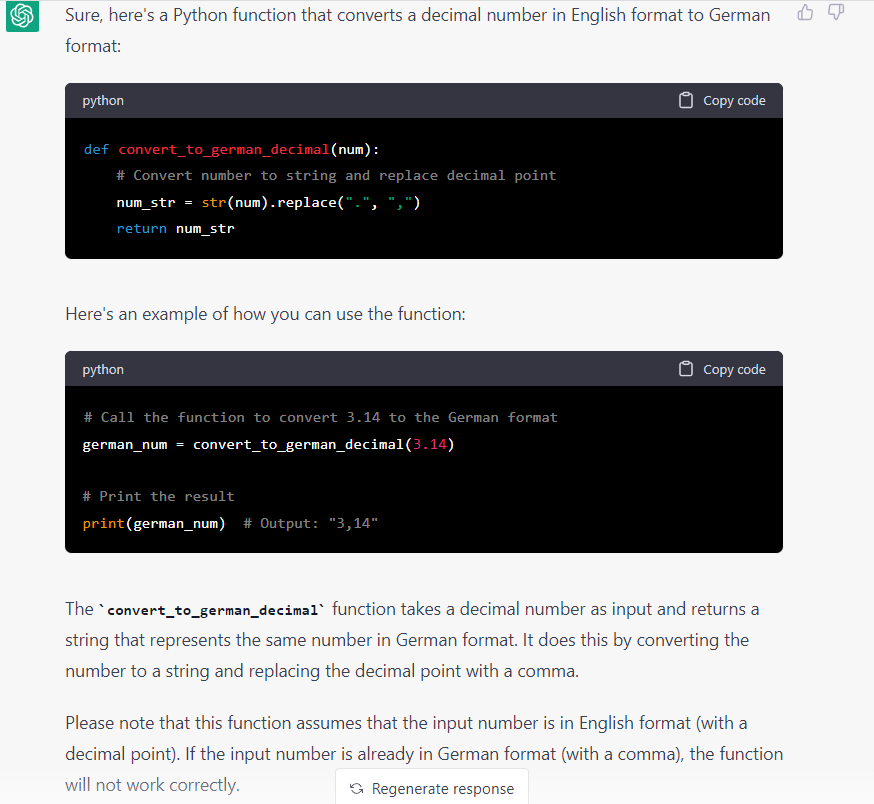
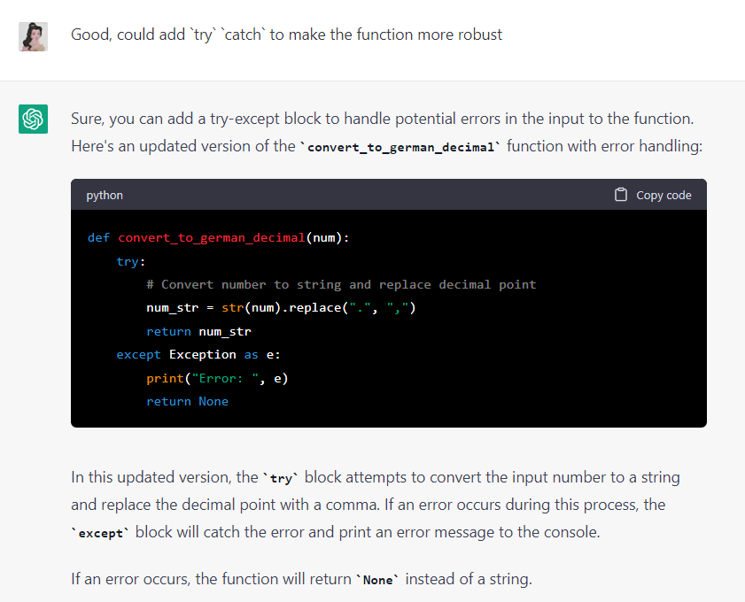
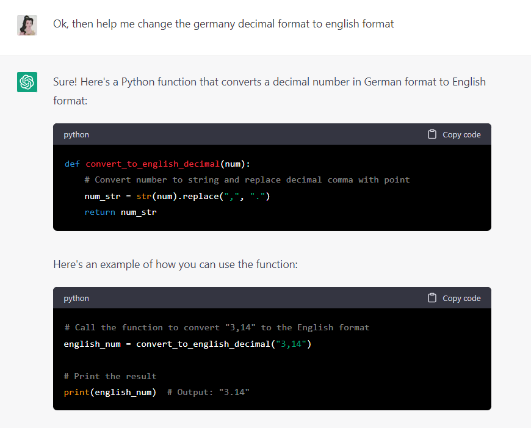
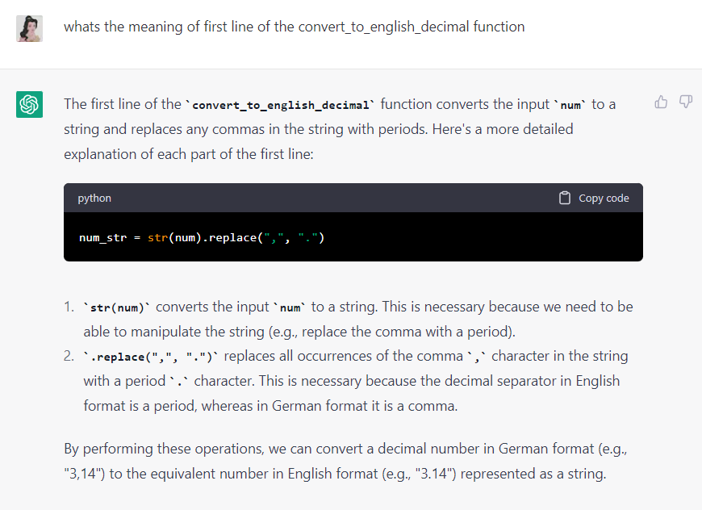

# Use ChatGPT to write function
To help you write code, please provide ChatGPT with the following information:

1. What programming language are you using?
2. What is the specific task you want to accomplish?
3. Do you have any existing code that you have tried? If so, please share it with me.
4. Do you have any specific requirements or constraints that ChatGPT should be aware of?
5. Any additional information or context that may be relevant.
Once ChatGPT has this information, it can assist you in writing the code you need.

## Example
Please help me write a function or code to change the English in the decimal to German in python

## Result
You will get the answer from ChatGPT:

## Tips
You can ask the meaning of each line or change your purpose.

### Change the code more robust

### Change your target

### Ask details of the code
