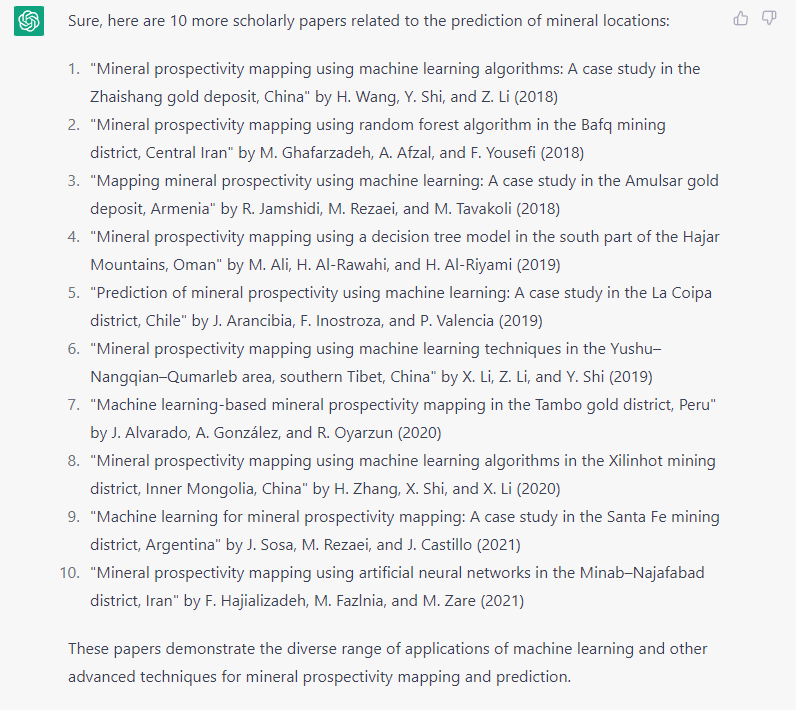

# Use ChatGPT to write function
To help you with your research, you can use CHATGPT to quickly read and summarize papers.

## Example
Ask ChatGPT provide the related papers and summarize the information.

Please help me write a function or code to change the English in the decimal to German in python


## Result
You will get the answer from ChatGPT:


## Tips
You can ask the more papaers and summarize information from papers.

### Ask more papers
Ask ChatGPT: 
```
give me 10 more papers
```


### Summarize


