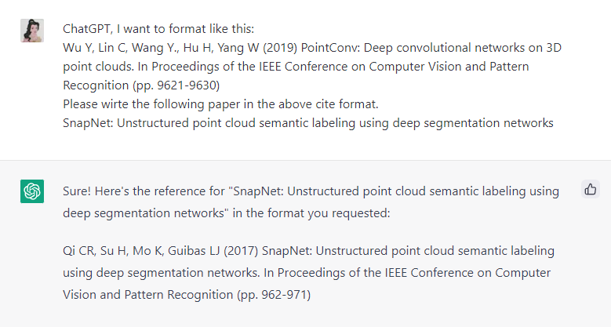
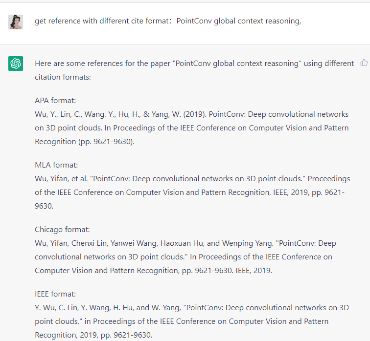

# Use ChatGPT to write function
To help you write the correct reference format, you have to provide the correct format and the target paper.

## Example
ChatGPT, I want to format like this:
Wu Y, Lin C, Wang Y., Hu H, Yang W (2019) PointConv: Deep convolutional networks on 3D point clouds. In Proceedings of the IEEE Conference on Computer Vision and Pattern Recognition (pp. 9621-9630)
Please wirte the following paper in the above cite format.
SnapNet: Unstructured point cloud semantic labeling using deep segmentation networks

## Result

## Tips
You can directly ask ChatGPT write differnce cite format for you:
