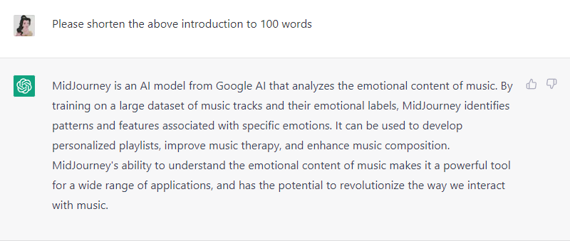

# Use ChatGPT to write introduction for something
provide ChatGPT with some context or information about what you need an introduction for. 
This could include the topic, purpose, audience, and any other relevant details that can help it understand what you are trying to accomplish. Once it has a better understanding of your needs, it can begin to craft an introduction that meets your requirements.

## Example
please write a long introduction for 'MidJourney' model from google AI (over 500 words)


## Result
ChatGPT will return you:
```
MidJourney is an artificial intelligence (AI) model developed by Google AI that is designed to understand the emotional content of music. Music has always been a powerful force in human culture, with the ability to evoke a wide range of emotions and bring people together. However, understanding the emotional content of music can be difficult, as it often relies on subjective experiences and personal preferences. MidJourney represents a significant advance in the field of music analysis and recommendation, offering a powerful tool for understanding and analyzing the emotional qualities of music.

At its core, MidJourney is a deep learning model that has been trained on a large dataset of music tracks and their associated emotional labels. By analyzing the musical qualities of these tracks and comparing them to their emotional labels, MidJourney has learned to identify patterns and features that are associated with specific emotions. This enables the model to predict the emotional content of a song based on its musical features, such as rhythm, melody, harmony, and tempo.

One of the key benefits of MidJourney is its ability to analyze music in a way that is more aligned with human perception. Unlike other music analysis tools that rely solely on objective measures such as tempo and key, MidJourney takes into account the subjective experience of music and the emotional response it evokes. This makes it a powerful tool for understanding the complex relationship between music and emotion, and for developing new ways to enhance the emotional impact of music.

For example, MidJourney could be used to develop personalized playlists based on a listener's emotional state. By analyzing the emotional content of a listener's favorite songs, MidJourney could identify the specific emotional qualities that resonate with that listener and recommend new songs that match those qualities. This could help music services to offer more personalized and relevant recommendations, and improve the overall listening experience for users.

MidJourney could also be used to improve music therapy. Music therapy is a growing field that uses music to help individuals manage physical, emotional, and cognitive difficulties. By analyzing the emotional content of different types of music, MidJourney could help therapists to select music that is best suited to a patient's emotional needs. This could help to improve the effectiveness of music therapy and provide a more tailored and personalized experience for patients.

Another potential application of MidJourney is in the development of new music composition tools. By analyzing the emotional content of existing music, MidJourney could identify patterns and features that are associated with specific emotional qualities. This could help composers to create music that is more emotionally impactful and resonant with listeners.

Overall, MidJourney represents a significant advance in the field of music analysis and recommendation. Its ability to understand the emotional content of music makes it a powerful tool for a wide range of applications, from personalized music recommendations to music therapy and composition. With ongoing research and development, MidJourney has the potential to revolutionize the way we think about and interact with music.
```

## Tips
You can continue let chatGPT modify its result
