# 如何用 Midjourney 创作你的第一幅 AI 作品

### 1）关键词生成图片

回到我们的服务器，然后在下面的输入框输入“/”，它会弹出一系列的命令（如果没弹窗，退出重新登录即可），我们先点击“/imagine”（这个参数我后面再做详细解释），然后会出现如下画面：

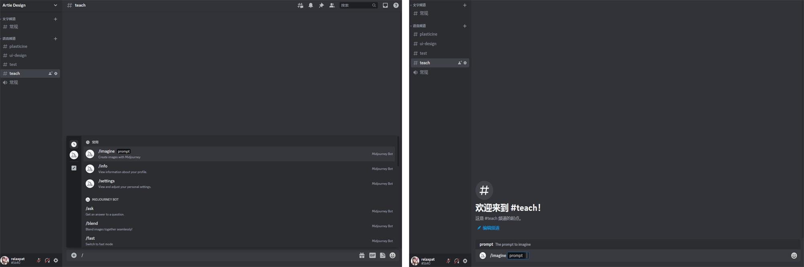

输入一组关键词，切记：一组关键词的后面需要加上英文的逗号“,”然后按空格键，空一格就行，看我下面这组关键词：

An mascot robot, smiling, modern robot, round robot, cartoon, flying, fist up, crypto coins background
（吉祥物机器人，微笑，现代机器人，圆形机器人，卡通，飞行，拳头，加密币背景）

然后我们接着上一步，在对话框内输入这组关键词，我建议大家不要直接复制，先用键盘敲，体验下这个操作。

点击回车发送，然后它会让我们进行授权，我们点击“Accept tos”授权就行了。

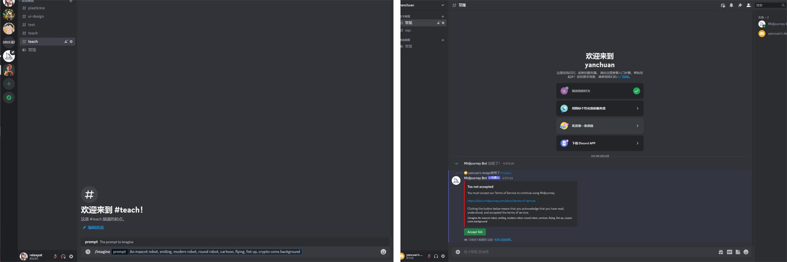

然后等待机器人的出图，在发送的关键词后面可以看到图片生成的进度，等一会就会出来图片了：

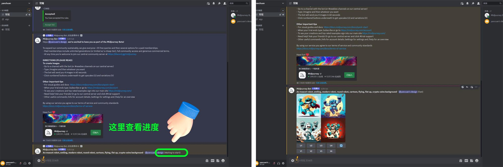

### 2）图片指令及导出图片

生成完成后，会出现两排按钮

U 的意思放大图片，U1/U2/U3/U4 分别指的是放大四张图片中的某一张
V 的意思采用图片的构图形式，重新生成一组类似的图片，V1/V2/V3/V4 的顺序与 U 的顺序一样，如图

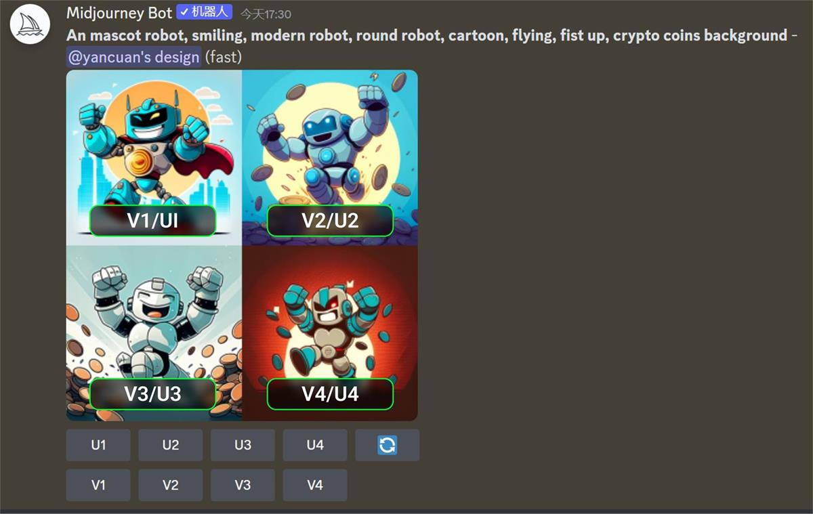

举个栗子，比如我想要导出第一张图片，那么我们点击 U1 就好了（等待机器出图）：

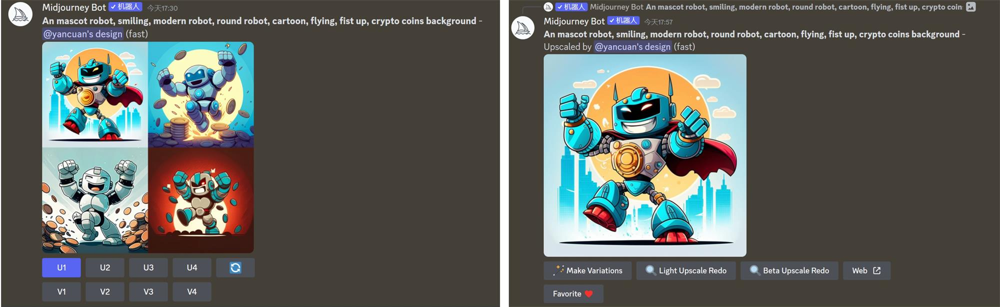

然后咱们点击图片，点击在浏览器中打开，然后保存图片，这张图片就被下载了（一定要用浏览器打开再保存图片，不然图片的尺寸会很小，会模糊的）

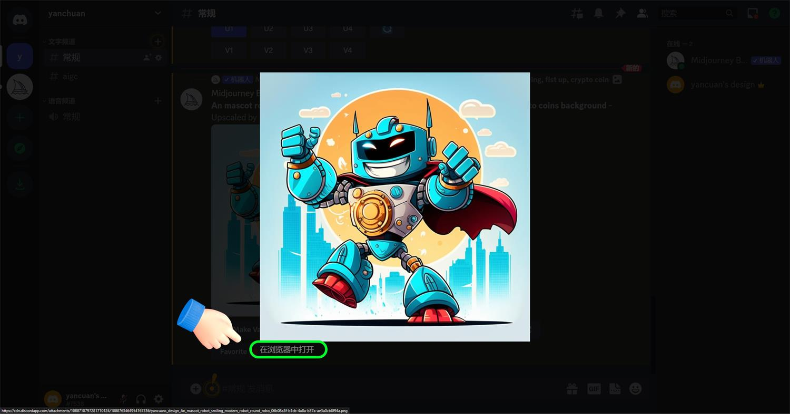

换个栗子，我觉得第一张图片还行，构图风格还不错，就是差点细节，想要再优化下，那我们就点击 V1，接下来的操作就与上面一样啦，是不是很简单。

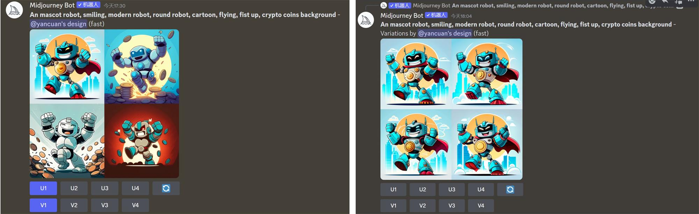

一般情况下，我们可以把同一组关键词多生成几组图片，这里可以点击“重复”按钮，然后你就会看见多条生成图片的消息，等待机器人作图，然后找到你喜欢的几张图片进行挑选即可。

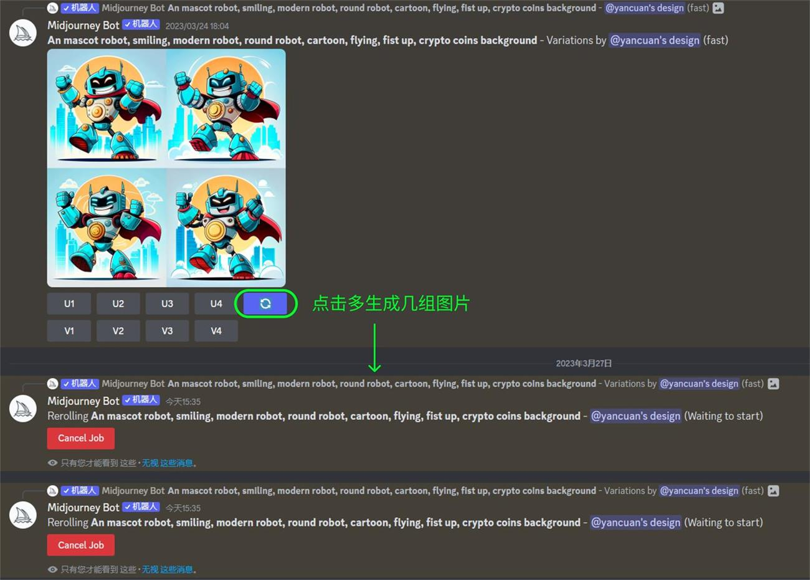

3）Midjourney 的尺寸和分辨率

所有尺寸均为正方形 1:1 的长宽比。

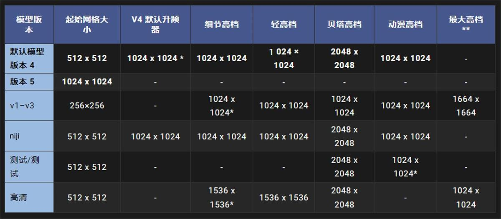

每个 Midjourney 版本模型的默认升频器。

4）使用高档重做按钮

升级图像（U1、U2、U3、U4）后，你会在图像下方看到一行按钮，可让您使用不同的升级器模型重新进行升级。

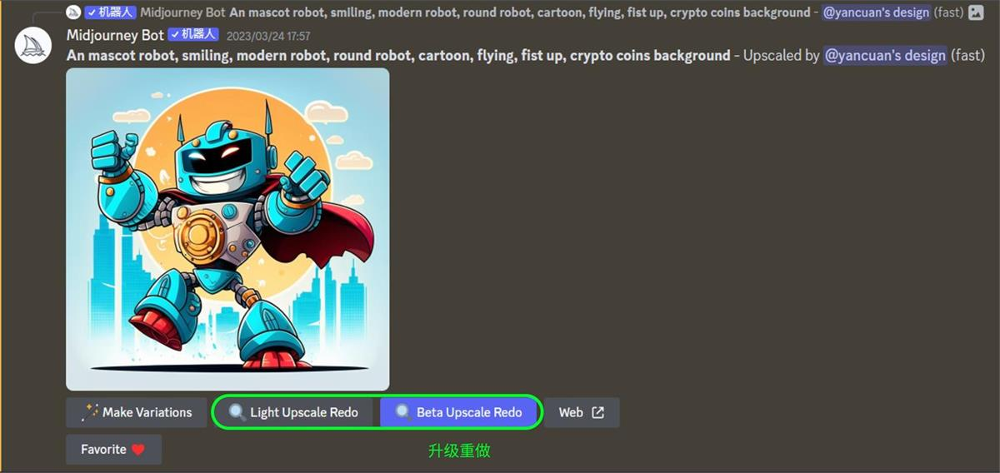

点击重做，Midjourney 会在原图的基础上优化和调整细节，有些情况重做的效果不如原效果，根据情况调整。

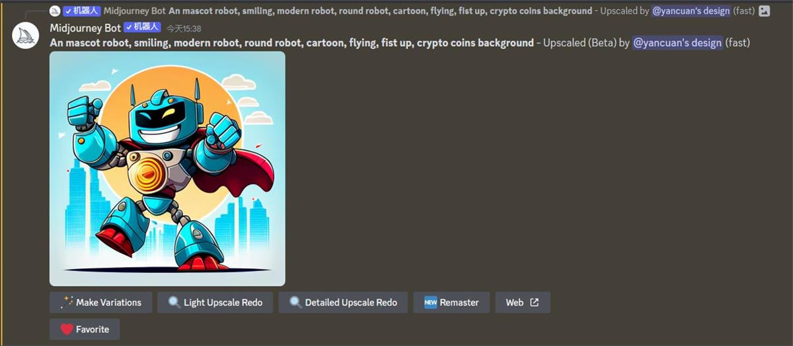


# AI 绘画描述词分享

这里给大家分享下关键词词汇，帮助大家更快的掌握 AI 绘图，篇幅有限，有需要的朋友可以试试这个网站：

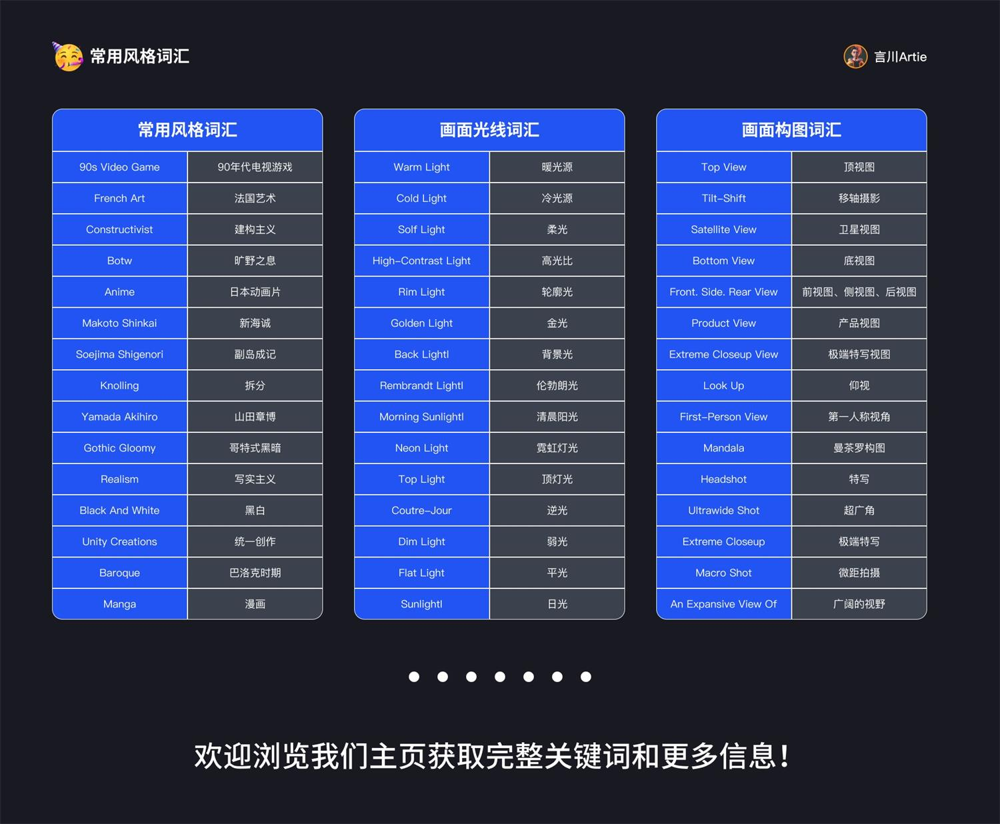


Midlibrary！收录 2000+ 风格关键词的Midjourney提示资源库
大家好，这里是和你们一起探索 AI 绘画的花生~ 今天为大家推荐一个实用超强的 Midjourney 提示词资源网站 Midlibrary，它由国外艺术家 Andrei Kovalev 主导建立，目前收录了 2078 种适用于 Midjourney 的风格流派、艺术运动、技法及艺术家关


# Discor 操作命令

### 1）基本命令概述

（这里只列出一些我们会用到的参数命令，其他的参数对我们学习 AI 绘画意义不大）

| 命令 | 描述 |
| --- | --- |
| /ask | 获取问题的答案。你可以提一些问题让 midjourney 给你回答，类似 FAQ； |
| /blend | 融图，一共可以上传 6 张图片，发送给机器人会帮你把上传的图片融合一起生成新的一组图片； |
| /docs | 在官方的 Midjourney Discord 服务器中使用，可以快速生成本用户指南中涉及的主题链接； |
| /fast | 切换到快速模式，一般还有 Fast 使用时长不需要切换这个命令； |
| /help | 显示关于 Midjourney Bot 的有用基本信息和提示，帮助中心，字面意思； |
| /imagine | 使用提示生成一个图像，这个就是生图的命令，输入关键词发送； |
| /info | 查看关于你的账户和任何排队或运行中的工作的信息，可以查看账户的剩余作图时长等相关信息； |
| /stealth | 对于专业计划的用户（60 美金/月）：切换到隐身模式。意思是你生成的图片不在社区展示； |
| /public | 对于专业计划的用户（60 美金/月）：切换到公共模式，字面意思； |
| /subscribe | 为用户的帐户页面生成个人链接； |
| /settings | 查看和调整 Midjourney Bot 的设置； |
| /prefer option set | 创建或管理一个自定义选项； |
| /prefer option list | 查看你当前的自定义选项； |
| /prefer suffix | 指定一个后缀，添加到每个提示的末尾； |
| /show | 使用图像作业 ID，在 Discord 内重新生成作业； |
| /relax | 切换到放松模式。这个模式比 Fast 慢，一般付费的同学用完 Fast 之后会自动切换到 Relax； |
| /prefer remix | 开启/关闭混音模式。 |

### 2）/imagine 关键词作图

输入“/”，选择“imagine”，然后会出现这种状态：

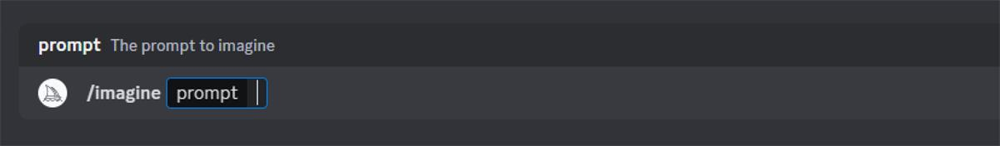


在 Prompt 后面输入英文关键词，格式上面说了，一组关键词+ , + 空格 +关键词：

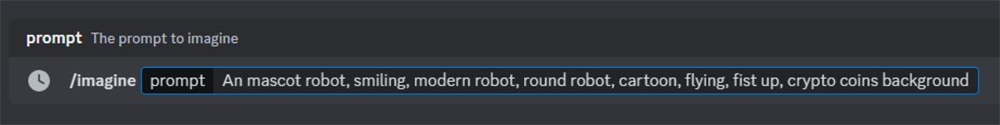


点击发送等待出图就可以了，在上面演示了这个操作，还不清楚的再看一遍这个操作流程。

### 3）/blend 多张图片融图

输入“/”，选择“blend”，然后会出现这种状态：

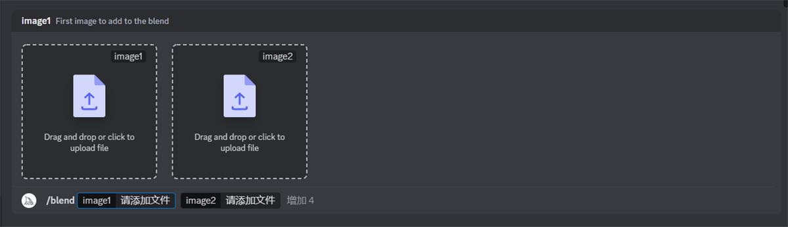


选择上传的图片，默认是上传两张，可以点击增加，一共是 6 张：

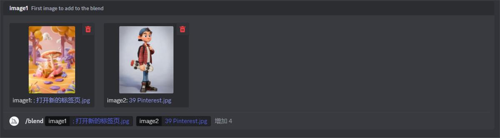

发送等待出图，然后大功告成：

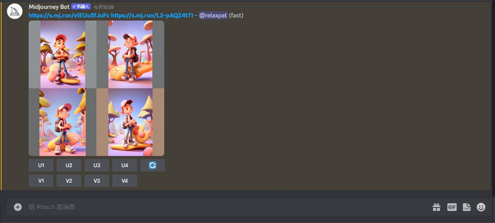


### 4） /settings 调整机器人设置

输入“/”，选择“settings”，直接发送，然后出现下列参数设置：

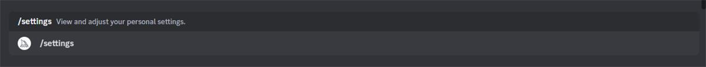
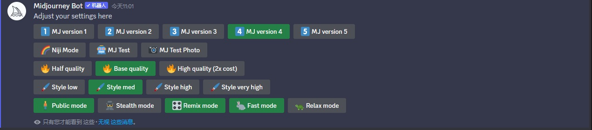

### 版本设置

下面这些是选择绘图的模式，目前 V5 模式仅适用于订阅用户，点击选中：

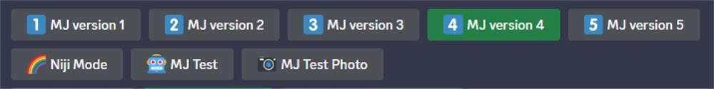

大家一般用 V4 或者 V5 就好了，其他的可以尝试，Midjourney V5 模型是最新最先进的模型，该模型具有非常高的 Coherency，擅长解释自然语言提示，分辨率更高

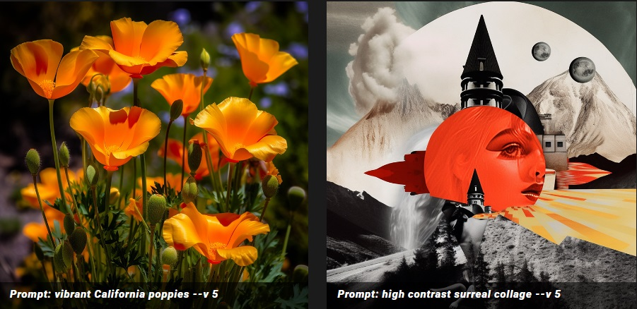

Midjourney V4 模型具有三种略有不同的"风格”，对模型的风格调整进行了细微调整，通过在 V4 提示末尾添加--style a --style 4b 或来试验这些版本。--v 4 --style 4c 是当前默认值，不需要添加到提示末尾。

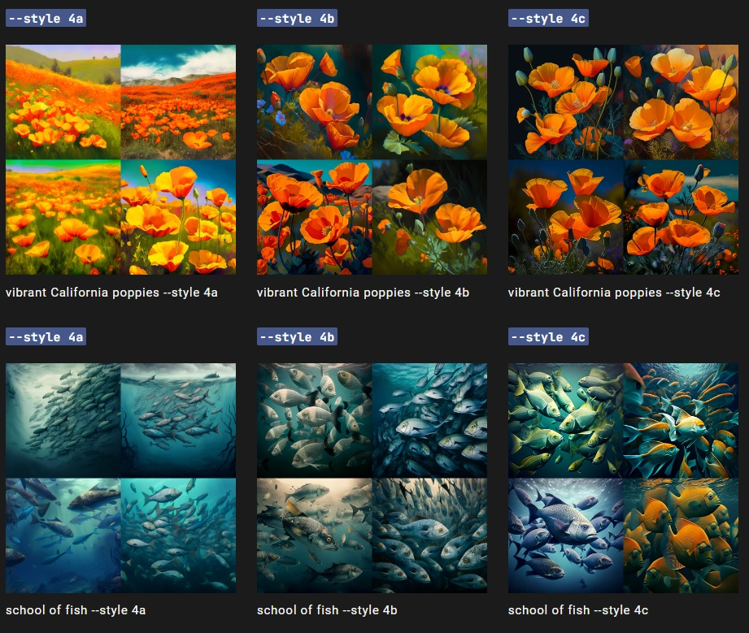


Midjourney V1 - V3 您可以使用--version 或--v 参数或使用/settings 命令并选择模型版本来访问更早的 midjourney 模型。不同的模型擅长处理不同类型的图像。

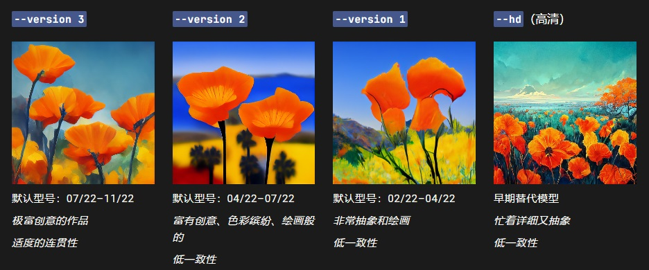

Niji Model 该模型是 Midjourney 和 Spellbrush---niji 之间的合作，经过调整可以制作动画和插图风格。该模型对动漫、动漫风格和动漫美学有更多的了解。一般来说，它在动态和动作镜头以及以角色为中心的构图方面表现出色。--niji

一般这个模型用在动画插画上，如果你需要画一幅插画，那么用 niji 模式比 V 系列模型效果更好。

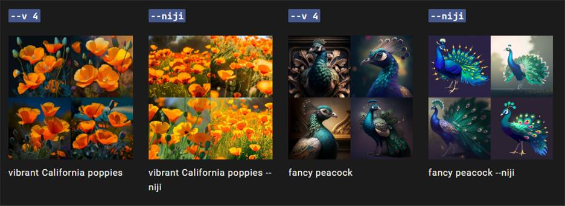

MJ test 偶尔会临时发布新模型以供社区测试和反馈。目前有两种可用的测试模型：--test 和--testp，它们可以与--creative 参数结合使用以获得更多不同的成分。（一般不会使用这个模型）

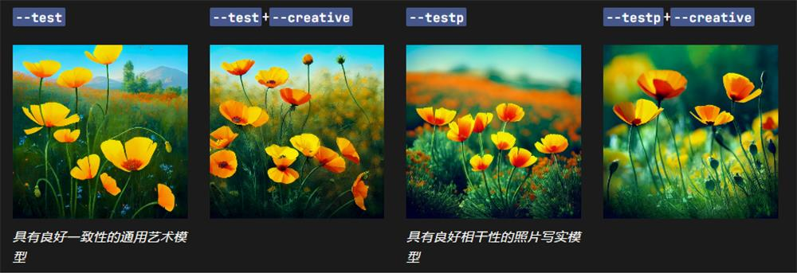

可以在关键词后面这样设置版本，在关键词后面加入版本参数设置不受默认设置的影响。


### 图片质量

设置用于作业的质量参数。半质量 = --q .5，基本质量 = --q 1，高质量 = --q 2。

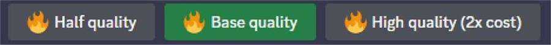

参数更改生成图像所花费--quality 的--q 时间。更高质量的设置需要更长的时间来处理并产生更多的细节。更高的值还意味着每个作业使用更多的 GPU 分钟数。质量设置不影响分辨率。

默认 --quality 值为 1。较高的值会使用更多订阅的 GPU 分钟。

--quality 接受以下值：默认模型的 .25、.5 和 1。较大的值将向下舍入为 1。

--quality 仅影响初始图像生成。

--quality 适用于模型版本 1、2、3、4、5 和 niji。

更高的 --quality 设置并不总是更好。有时较低的 --quality 设置可以产生更好的结果——这取决于您尝试创建的图像。较低的 --quality 设置可能最适合抽象外观。较高的 --quality 值可以改善受益于许多细节的建筑图像的外观。选择与您希望创建的图像类型最匹配的设置。

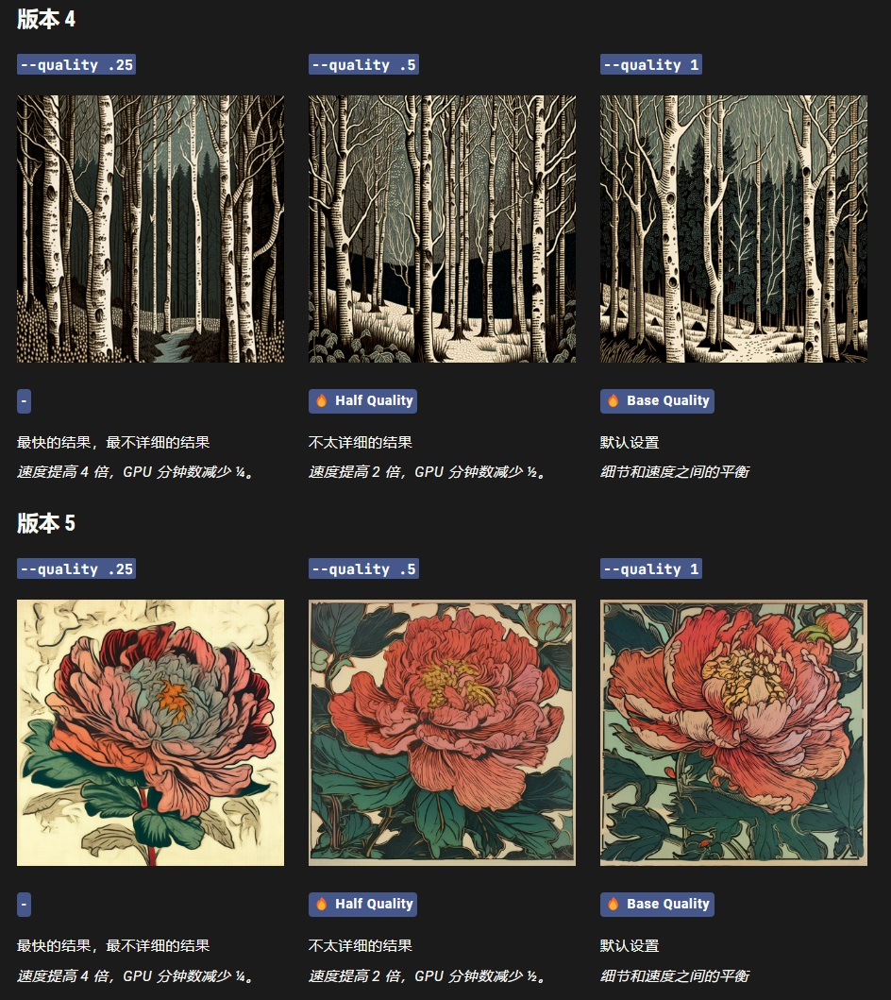

版本可兼容的参数设置，没有打勾的代表该参数不能生效。

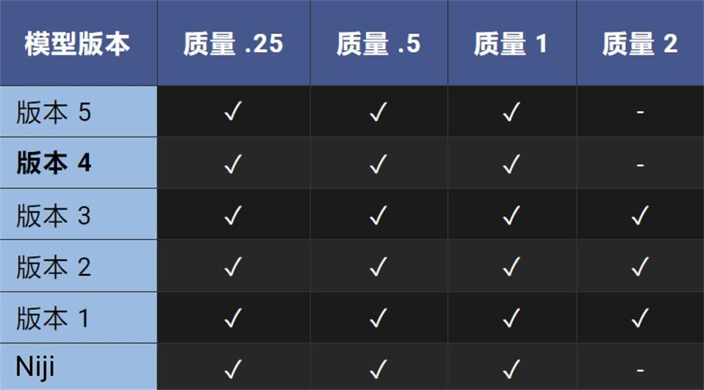

可以在关键词后面这样设置参数，在关键词后面加入参数设置不受上面默认设置的影响：

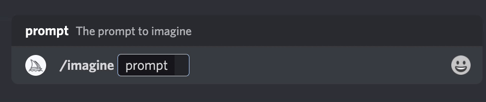


### 风格化参数

设置用于作业的风格化参数。

风格低 = --s 50，风格中 = --s 100，风格高 = --s 250，风格非常高 = --s 750，

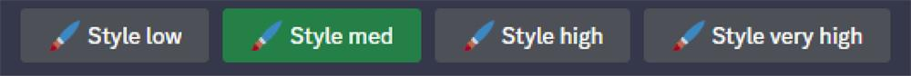

这个 Midjourney Bot 经过训练可以生成有利于艺术色彩、构图和形式的图像。或参数影响该训练应用 --stylize 的 --s 强度。低程式化值生成的图像与提示非常匹配，但艺术性较差。高程式化值创建的图像非常具有艺术性，但与提示的联系较少。

不同的 Midjourney 版本模型具有不同的风格化范围，表示只能在范围内输入数值。

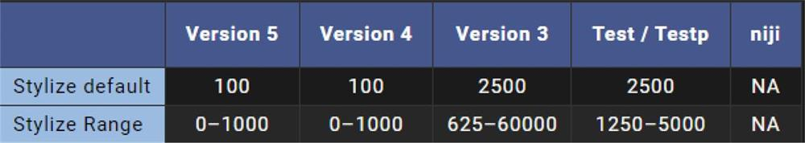

不同的数值生成的图片在细节上有较大的区别，大家根据图片效果可以适当的调试。

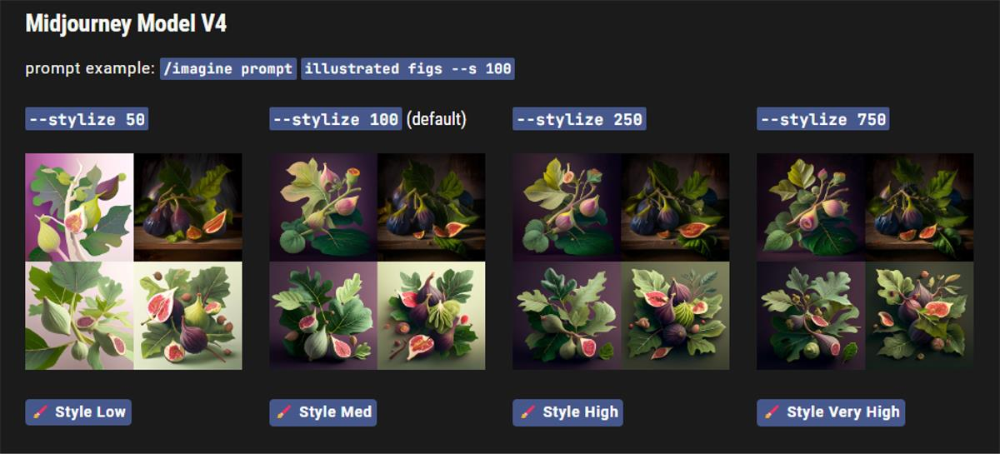
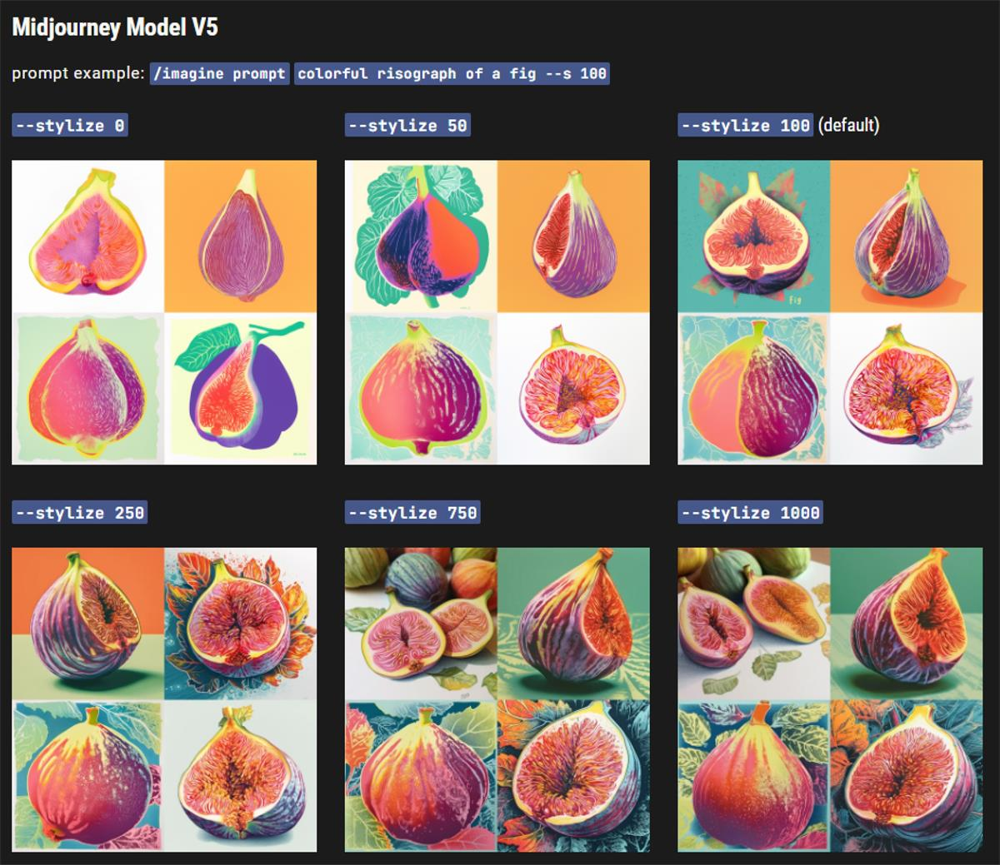


可以在关键词后面这样设置参数，在关键词后面加入参数设置不受上面默认设置的影响：


操作模式

在公共模式和隐身模式之间切换。对应于/public 和/stealth 命令。

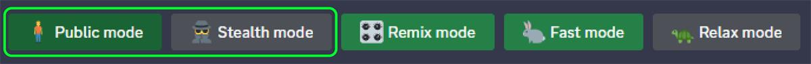

切换到混音模式
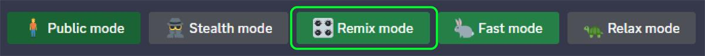


/prefer remix 使用命令或使用/settings 命令并切换按钮激活混音模式 🎛️ Remix Mode。Remix 更改图像网格下的变化按钮（V1、V2、V3、V4）的行为。启用 Remix 后，它允许您在每个变体期间编辑提示。要重新混合高档选择🪄 Make Variations。

启用后 Remix，变体按钮在使用时变为绿色而不是蓝色。

您可以在使用 Remix 时切换模型版本。

完成 Remix 后，使用/settings 或/prefer remix 命令将其关闭。

通过不修改弹出窗口中的提示，在 Remix 处于活动状态时创建标准图像变体。

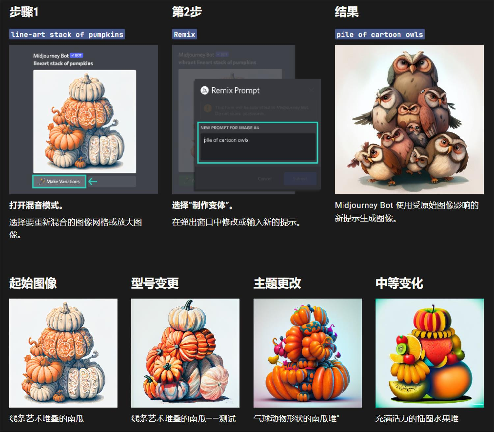

在 Fast 和 Relaxed 模式之间切换。对应于/fast 和/relax 命令。

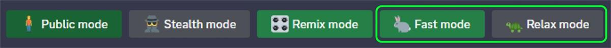


5） /prefer option set 自定义首选项参数

使用 prefer 命令创建自定义选项，以自动将常用参数添加到提示末尾。

/prefer auto_dm 完成的工作会自动发送到直接消息

/prefer option 创建或管理自定义选项。

/prefer option list 查看您当前的自定义选项。

/prefer suffix 指定要添加到每个提示末尾的后缀。

/prefer option set 创建可用于将多个参数快速添加到提示末尾的自定义参数。


/prefer option set mine --hd --ar 7:4 创建一个名为“我的”的选项，转换为--hd --ar 7:4.

使用/imagine prompt vibrant California poppies --mine, 被解释为/imagine prompt vibrant California poppies --hd --ar 7:4。

将“value”字段留空以删除选项。

/prefer option list 列出使用创建的所有选项 prefer option set. 用户最多可以有 20 个自定义选项。

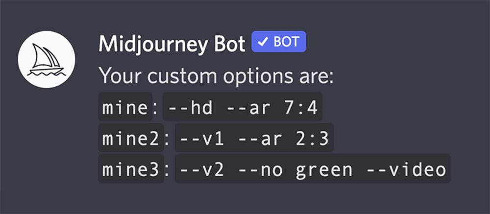


要删除自定义选项，请使用/prefer option set 值字段并将其留空。

6）/info 查看账号服务信息

使用该/info 命令查看有关当前排队和正在运行的作业、订阅类型、续订日期等信息。

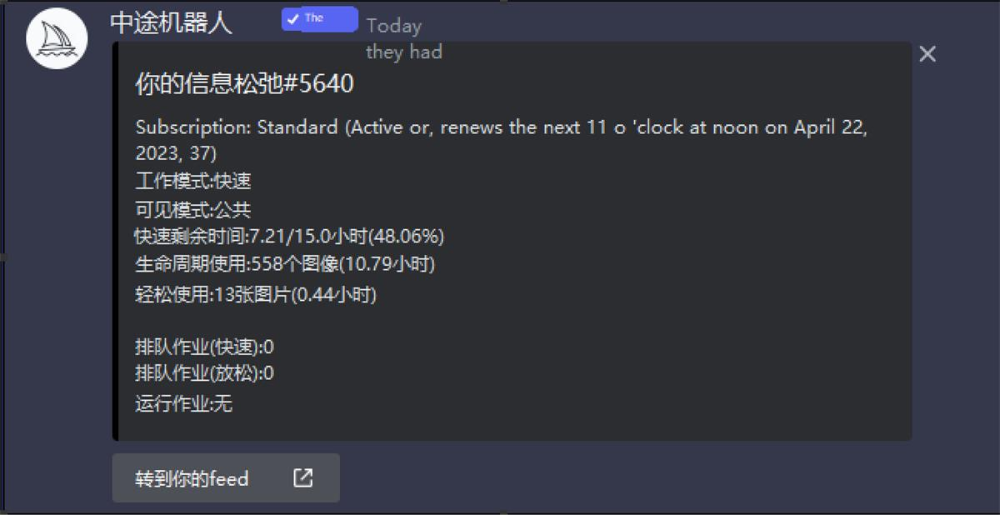


4. Imagine 关键词绘图

1）关键词的结构组成

基本关键词：一个基本的提示可以简单到一个单词、短语或表情符号。

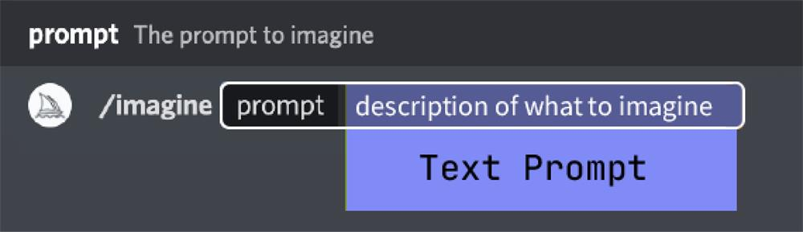


高级关键词：可以包括一个或多个图像链接、多个文本短语或单词，以及一个或多个后缀参数

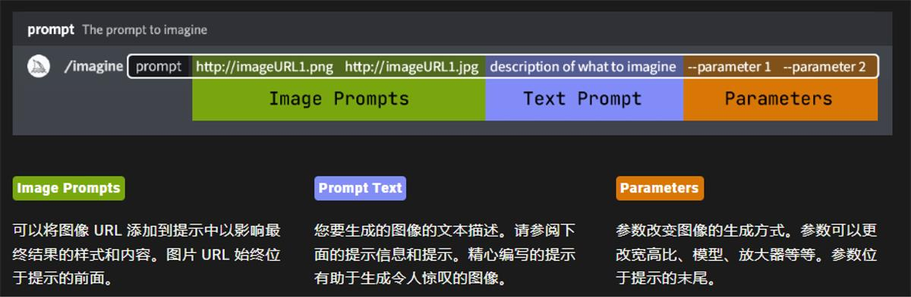


2）关键词的语法顺序

| 语法   | 关键词 |
| ------ | --------------------------------- |
| 主题   | 人、动物、人物、地点、物体等。 |
| 媒介   | 照片、绘画、插图、雕塑、涂鸦、挂毯等。 |
| 环境   | 室内、室外、月球上、纳尼亚、水下、翡翠城等。 |
| 照明   | 柔和、环境、阴天、霓虹灯、工作室灯等。 |
| 颜色   | 充满活力、柔和、明亮、单色、彩色、黑白、柔和等。 |
| 情绪   | 稳重、平静、喧闹、精力充沛等。 |
| 构图   | 人像、爆头、特写、鸟瞰图等。 |

举个栗子：

| 语法   | 关键词 |
| ------ | --------------------------------- |
| 主题   | a woman wearing streetwear（一个穿着街头服饰的女人）|
| 媒介   | Vintage 90's anime style（90 年代的复古动漫风格） |
| 环境   | cluttered 7/11 interior（凌乱的 7/11 室内） |
| 照明   | neon lights（霓虹灯）|
| 颜色   | sci-fi colors（科幻色彩） |
| 情绪   | noisy（喧闹） |
| 构图   | close up（近距离）|

完整关键词：
```
a woman wearing streetwear, Vintage 90's anime style, cluttered 7/11 interior, neon lights, sci-fi colors, noisy, close up
```

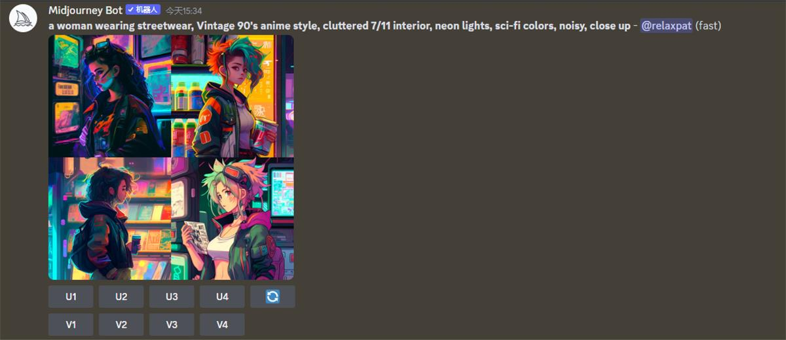

（当然，也不必这么严格，可以多尝试不同的关键词组合，只要我们能达到自己想要的效果即可）

提醒一下：关键词描述的越详细，生出的图片效果越精准。

3）关键词垫图（图生图）

关键词垫图就是大家所说的“喂图”，可以通过 Midjourney 绘制出与所垫的图片风格类似，具体来看看怎么做的吧：

上传参考图，点击输入框左侧的加号，选择上传图片（可多选图片上传）：

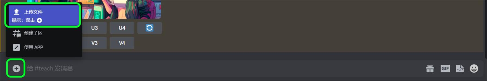

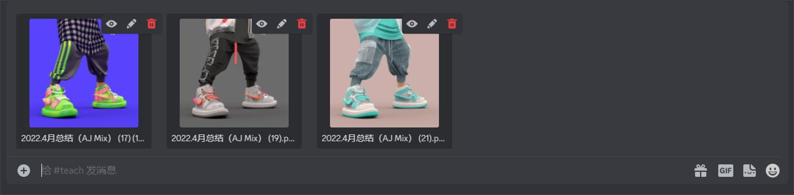


发送之后，右键点击图片，复制链接

注意：如果你在这里没出现“复制链接”，可以把图片点开然后右键复制链接，如果还复制不了，那你就把图片在浏览器打开，然后复制“图片地址”。

还有一个注意事项：图片地址的后缀必须是.png、.gif 或.jpg 结尾，不然图片不会生效。

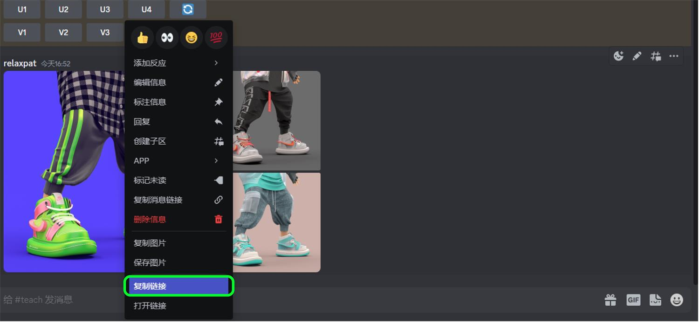

然后把链接复制到“/imagine”里，可以多个链接使用：

切记：每一个链接复制之后，必须空格一下，然后再复制第二个链接

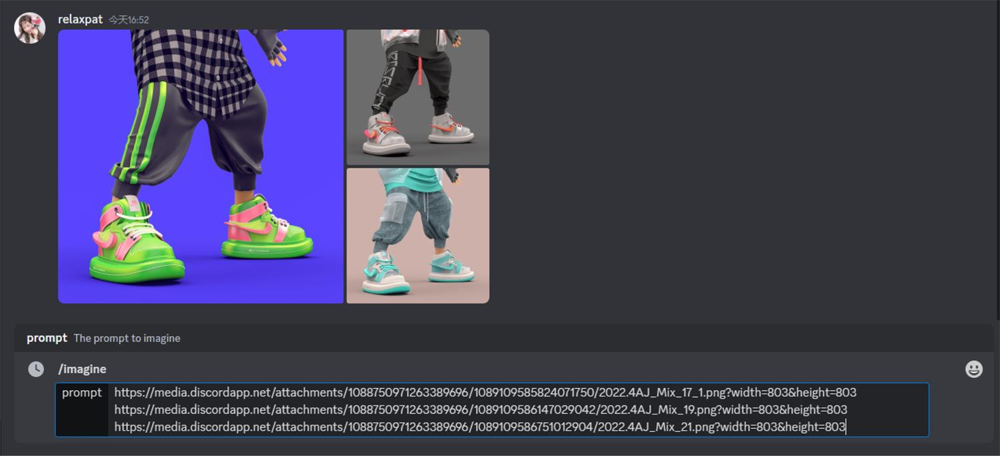

复制完链接之后还不能直接发送，直接发送会报错，这个跟“/blend”不一样，这个不是融图，你可以理解是给机器人作为参考。然后我们需要在链接后面打上关键词：

注意了，在链接后面也需要空一格才能生效，然后我们打上关键词：Adidas sneakers（阿迪达斯运动鞋）

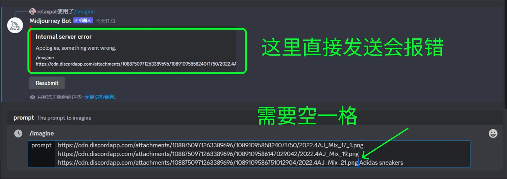

发送后就会生成类似风格的图片了，想要图片按你的想法来，那你就多描述关键词，多尝试跑图。

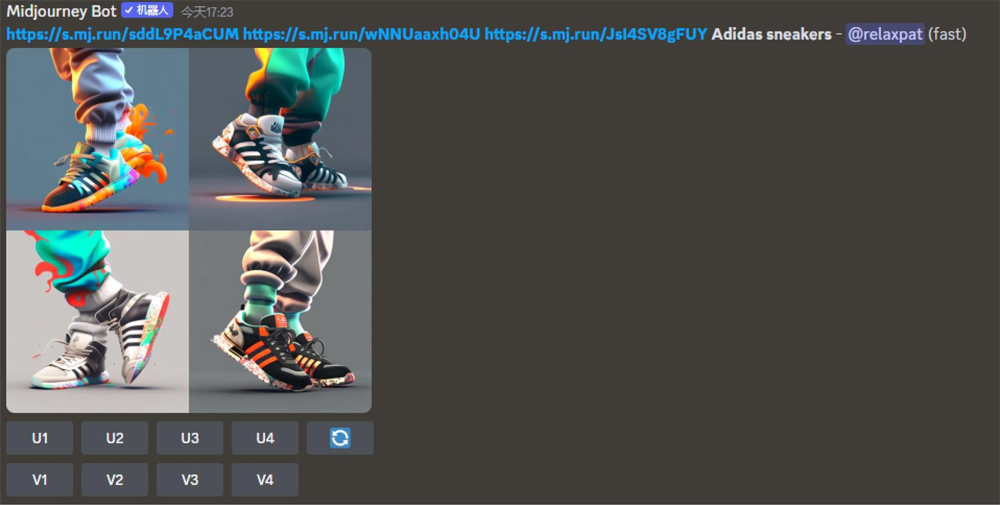

最后我们来看下官方演示的案例：

这里可以直接拖拽图片我也是没想到。6666 啊

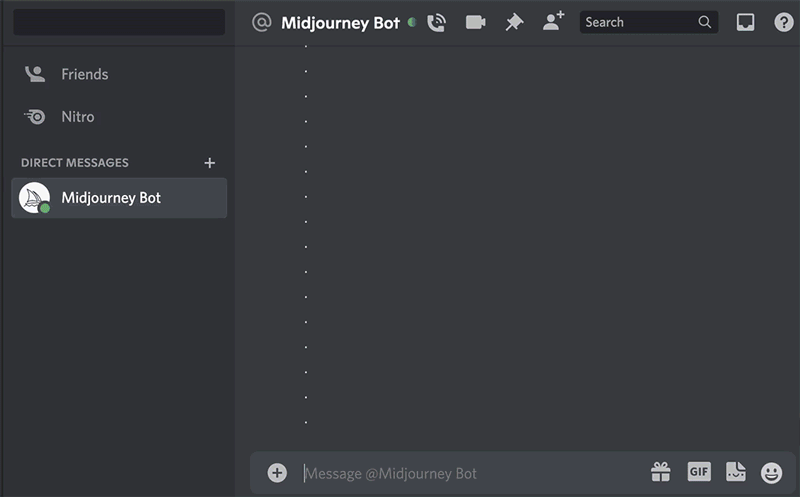

4）Multi Prompts 设置权重

可以让 Midjourney Bot 单独考虑两个或多个单独的概念::作为分隔符。分隔提示允许您为提示的各个部分分配相对重要性。

<b>多提示基础</b>

::在提示中添加双冒号向 Midjourney Bot 表明它应该分别考虑提示的每个部分。

在下面的示例中，对于提示，hot dog 所有单词都被考虑在一起，Midjourney Bot 生成美味热狗的图像。如果将提示分成两部分，hot:: dog 则将两个概念分开考虑，从而创建温暖的狗的图片。

```
双冒号之间没有空格::

Multi-prompts work with Model Versions 1 , 2, 3, 4Any 参数仍然添加到提示的最后。niji
```

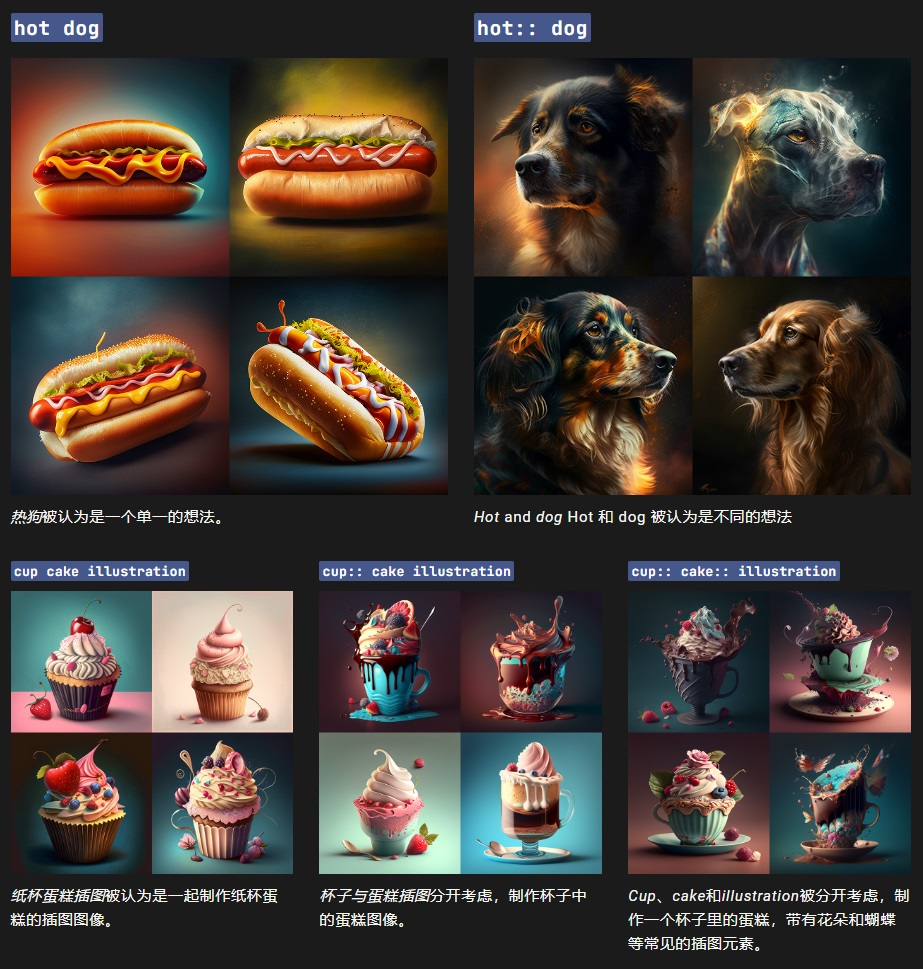

<b>提示权重</b>

当使用双冒号::将提示分成不同的部分时，您可以在双冒号后立即添加一个数字，以分配提示的该部分的相对重要性。

在下面的示例中，提示 hot:: dog 生成了一只热狗。将提示更改为使“热”hot::2 dog 一词的重要性是“狗”一词的两倍，从而产生了一只非常热的狗的图像！

V1, 2,3 只接受整数作为权重

V4 可以接受权重的小数位

非指定权重默认为 1。

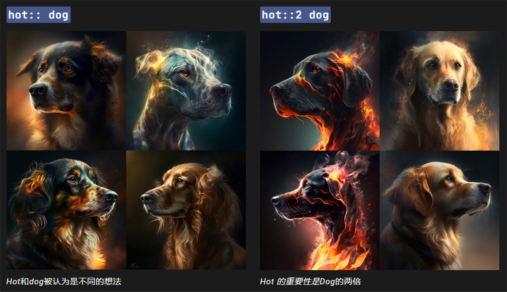


<b>负提示权重</b>

可以将负权重添加到提示中以删除不需要的元素，所有权重的总和必须是正数。

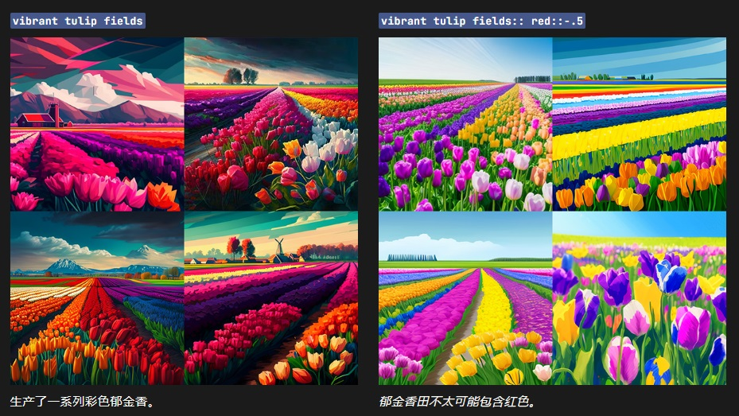


5. Imagine 关键词后缀参数

参数是添加到提示中的选项，可更改图像的生成方式。参数可以更改图像的纵横比、在 Midjourney 模型版本之间切换、更改使用的 Upscaler 等等。

参数总是添加到提示的末尾。您可以向每个提示添加多个参数。


1）基本参数

|参数|备注|
| ------ | --------------------------------- |
|纵横比（aspect ratios）|--aspect，或--ar 调整图片的比例；|
|混乱（chaos）|--chaos 改变结果的多样性。较高的值会产生更多不寻常和意外的结果；|
|负面提示（no）|--no 负面提示，在提示词末尾加上 --no 可以让画面中不出现某些内容；|
|生成质量（quality）|--quality <.25, .5, 1, or 2>，或--q <.25, .5, 1, or 2>您要花费多少渲染质量时间。默认值为 1。值越高渲染时间越高，值越渲染时间越低。|
|种子（seed）|--seed 用过 Midjourney 的同学会发现在发送提示词后，MJ 最开始的图像里会有一个非常模糊的噪点团 ，然后逐渐变得具体清晰，而这个噪点团的起点就是“Seed” 种子编号是为每个图像随机生成的，但可以使用 --seed 或 --sameseed 参数指定。使用相同的种子编号和提示将产生相似的结束图像。|
|停止（stop）|--stop 使用--stop参数在流程中途完成作业。以较早的百分比停止作业会产生更模糊、更不详细的结果。|
|平铺（tile）|--tile 参数生成可用作重复拼贴的图像，以创建织物、壁纸和纹理的无缝图案；|
|版本（version）|用--version 或--v 参数或使用/settings 命令并选择型号版本来使用其他型号。不同的模型擅长处理不同类型的图像。|
|风格（style）|--style <4a, 4b or 4c>在 Midjourney 模型版本 4 的版本之间切换|
|程序化（stylize）|--stylize ，或--s 参数会影响 Midjourney 的默认美学风格应用于 Jobs 的强度。|
|聚光灯（uplight）|--uplight 选择 U 按钮时使用替代的“轻型”升频器。结果更接近原始网格图像。放大后的图像细节更少，更平滑。|
|乌贝塔（upbeta）|--upbeta 选择 U 按钮时使用替代的 beta 升频器。结果更接近原始网格图像。放大后的图像添加的细节明显更少。|

默认值（模型版本 4）

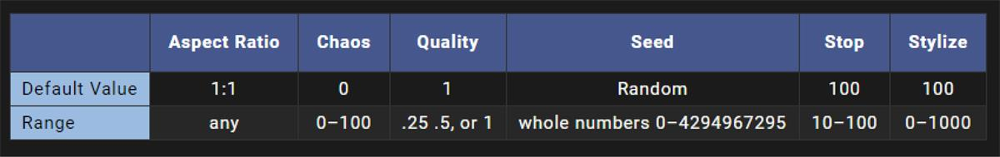


默认值（模型版本 5）

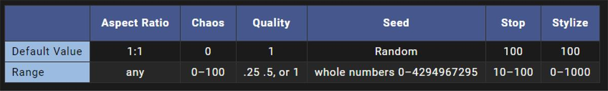

（大于 2:1 的宽高比是实验性的，可能会产生不可预测的结果）

2）模型版本参数

|参数|备注|
| ------ | --------------------------------- |
 |--niji | 另一种模型专注于动漫风格的图像；|
 |--hd |使用早期的替代模型来生成更大、更不一致的图像。该算法可能适用于抽象和风景图像；|
 |--test| 使用 Midjourney 特殊测试模型；|
 |--testp| 使用 Midjourney 特殊的以摄影为重点的测试模型；|
 |--version| <1, 2, 3, 4, or 5>或者--v <1, 2, 3, 4, or 5> 使用不同版本的 Midjourney 算法。当前算法 (V4) 是默认设置。|

3）其他参数

 --creative 修改 test 和 testp 模型更加多样化和创造性；
 --iw 设置相对于文本权重的图像提示权重。默认值为 --iw 0.25；
 --sameseed 种子值创建一个大的随机噪声场，应用于初始网格中的所有图像。当指定 --sameseed 时，初始网格中的所有图像都使用相同的起始噪声，并将生成非常相似的生成图像；
 --video 保存正在生成的初始图像网格的进度视频。表情符号使用 ☉️ 对完成的图像网格做出反应，以触发将视频发送到您的直接消息。--video放大图像时不起作用。
4）模型版本和参数兼容性

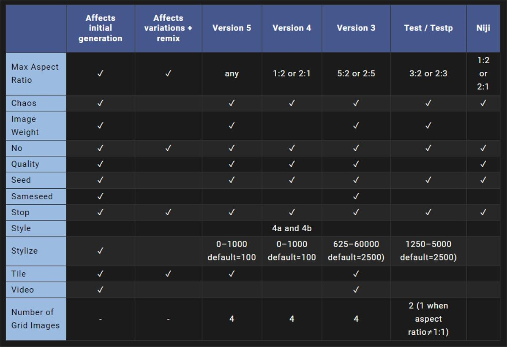

6. 常用后缀参数详解

1）Aspect Ratios（纵横比）

--aspect 参数--ar 更改生成图像的纵横比。宽高比是图像的宽高比。它通常表示为用冒号分隔的两个数字，例如 7:4 或 4:3。

正方形图像具有相等的宽度和高度，描述为 1:1 的纵横比。图片可以是 1000px × 1000px，或者 1500px × 1500px，纵横比仍然是 1:1。计算机屏幕的比例可能为 16:10。宽度是高度的 1.6 倍。所以图像可以是 1600px × 1000px、4000px × 2000px、320px x 200px 等。

默认纵横比为 1:1。

--aspect 必须使用整数。使用 139:100 而不是 1.39:1。
纵横比影响生成图像的形状和组成。

放大时，某些宽高比可能会略有变化。

最大纵横比

不同的 Midjourney 版本模型具有不同的最大纵横比。

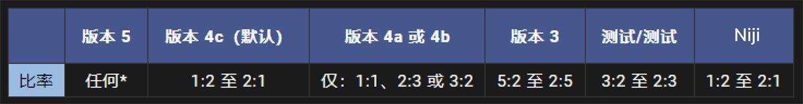

该--ar 参数将接受从 1:1（正方形）到每个模型的最大纵横比的任何纵横比。但是，在图像生成或放大过程中，最终输出可能会略有修改。示例：提示使用--ar 16:9(1.78) 创建具有 7:4(1.75) 纵横比的图像。

大于 2:1 的宽高比是实验性的，可能会产生不可预测的结果。

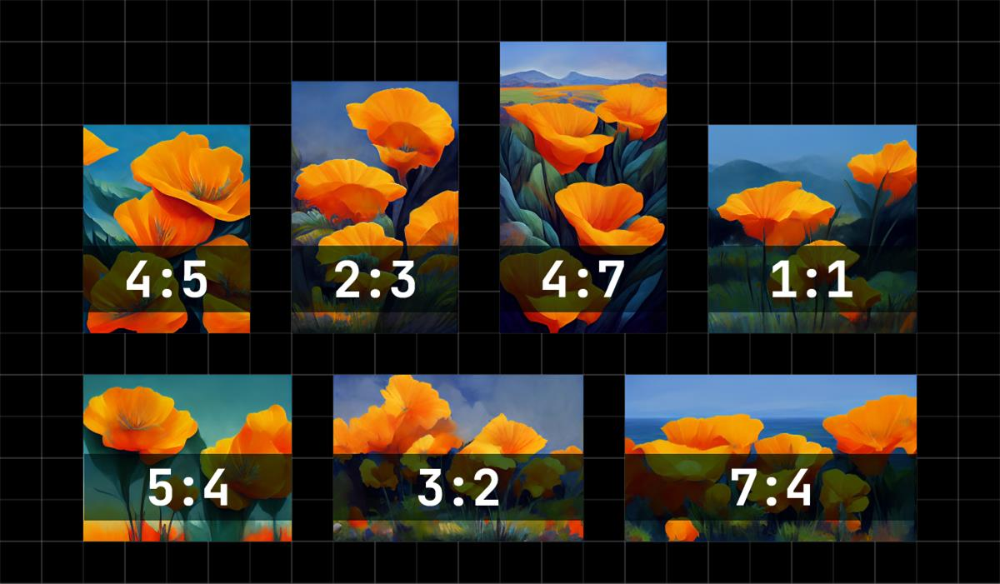

提示示例：imagine/ prompt vibrant california poppies --ar 5:4

常见的纵横比

--aspect 1:1 默认纵横比。

--aspect 5:4 常见的框架和打印比例。

--aspect 3:2 印刷摄影中常见。

--aspect 7:4 靠近高清电视屏幕和智能手机屏幕。

如何更改纵横比

添加--aspect  :<value > , 或--ar :< value > 到提示的末尾。


2）Chaos（混乱）

参数影响初始图像网格--chaos 的--c 变化程度。高--chaos 值将产生更多不寻常和意想不到的结果和组合。较低的--chaos 值具有更可靠、可重复的结果。

--chaos 范围值 0–100。

默认--chaos 值为 0。

chaos 的生成的效果

低值--chaos

使用较低的 --chaos 值或不指定值将生成每次运行作业时略有不同的初始图像网格。

提示示例：imagine/ prompt watermelon owl hybrid

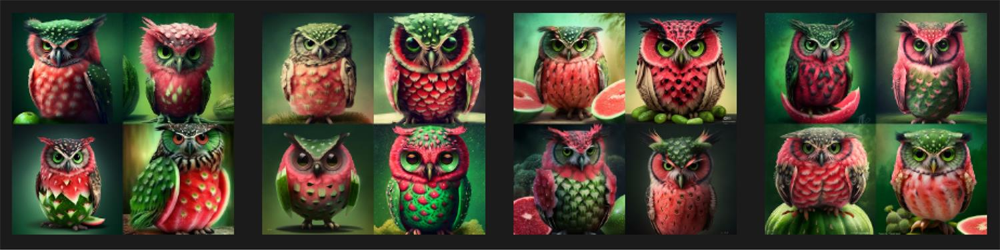

高值--chaos

--chaos 每次运行作业时，使用较高的值将产生更多变化和意外的初始图像网格。

提示示例：imagine/ prompt watermelon owl hybrid --c 50

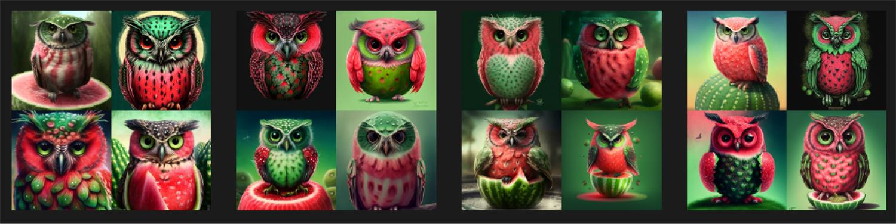

非常高的值--chaos

--chaos 每次运行作业时，使用极高的值将产生不同的初始图像网格，并且具有意想不到的构图或艺术媒介。

提示示例：imagine/ prompt watermelon owl hybrid --c 100

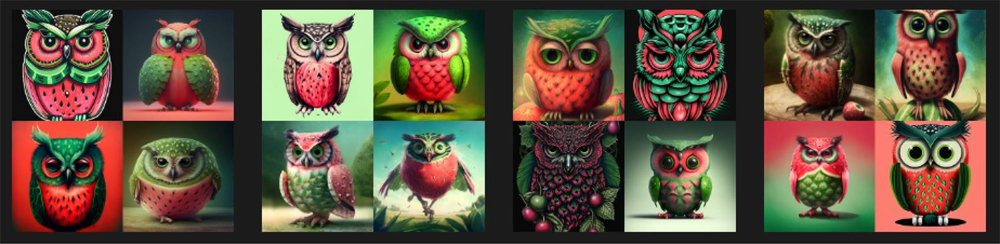

如何改变 Chaos 值

添加--chaos < value >或--c < value >到提示的末尾。


3）Quality（质量）

参数更改生成图像所花费--quality 的--q 时间。更高质量的设置需要更长的时间来处理并产生更多的细节。更高的值还意味着每个作业使用更多的 GPU 分钟数。质量设置不影响分辨率。

默认--quality 值为 1。较高的值会使用更多订阅的 GPU 时间。

--quality 接受以下值：默认模型的 .25、.5 和 1。较大的值将向下舍入为 1。

--quality 仅影响初始图像生成。

--quality 适用于模型版本 1、2、3、4、5 和 niji。

质量设置

更高的--quality 设置并不总是更好。有时较低的--quality 设置可以产生更好的结果——这取决于您尝试创建的图像。较低的--quality设置可能最适合抽象外观。较高的--quality值可以改善受益于许多细节的建筑图像的外观。选择与您希望创建的图像类型最匹配的设置。

提示示例：/imagine prompt woodcut birch forest --q .25

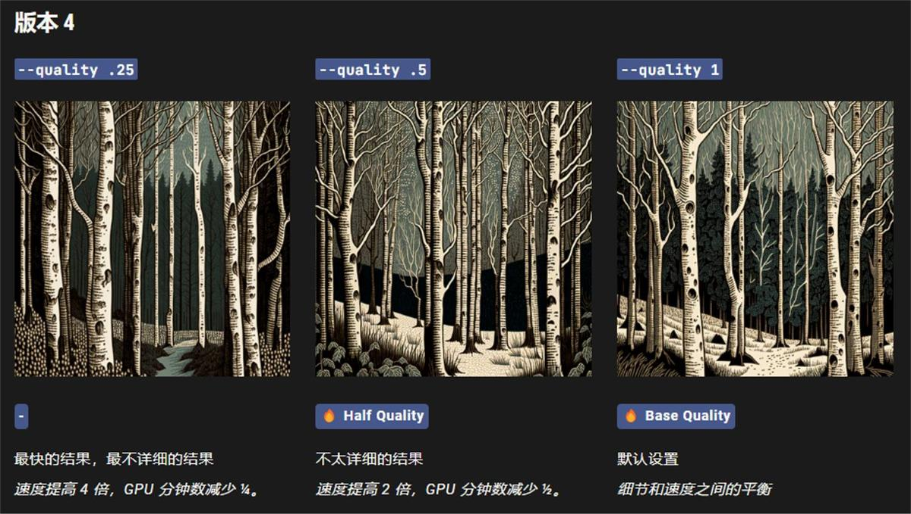

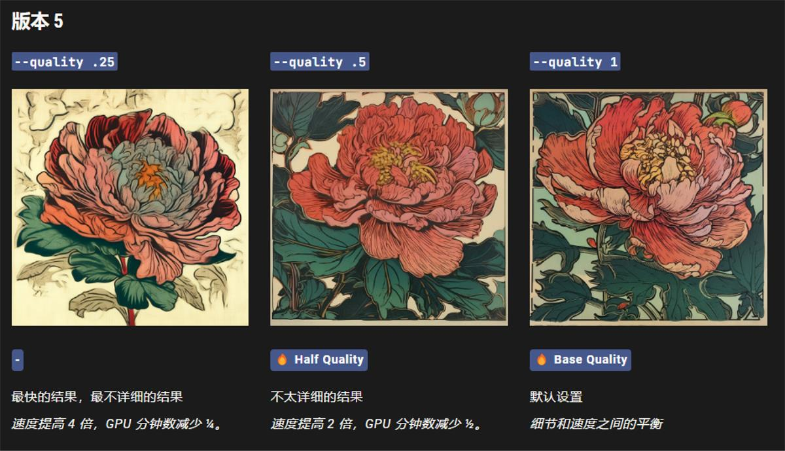

版本质量兼容性

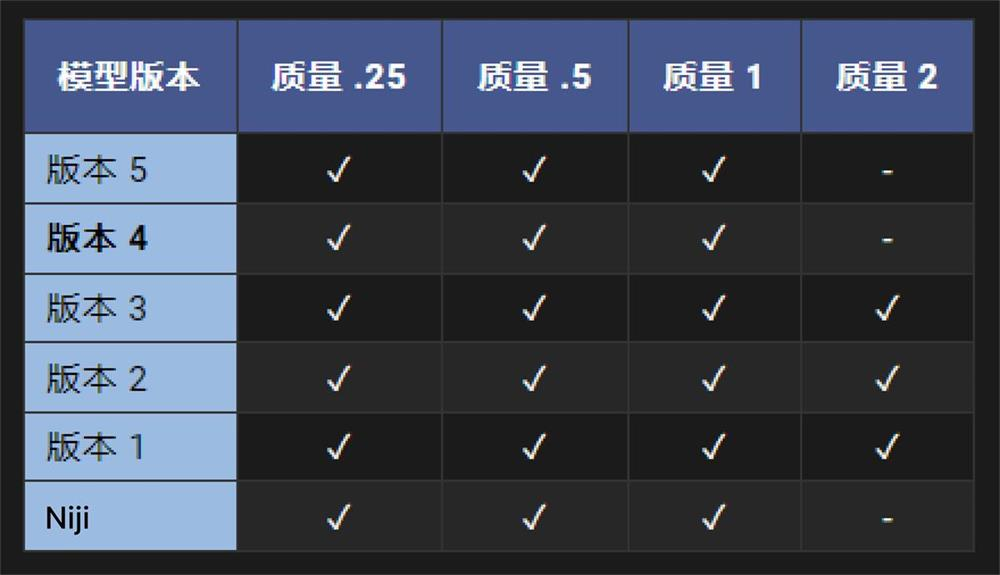

使用--quality 或--q 参数

添加--quality 或--q 到提示的末尾。


使用设置命令

从菜单中/settings 选择您的首选值。quality

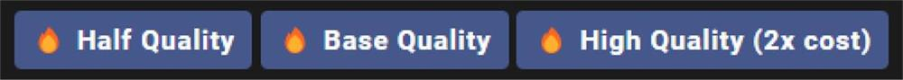

4）Seed（种子）

用过 Midjourney 的同学会发现在发送提示词后，MJ 最开始的图像里会有一个非常模糊的噪点团 ，然后逐渐变得具体清晰，而这个噪点团的起点就是“Seed” 种子编号是为每个图像随机生成的，但可以使用 --seed 或 --sameseed 参数指定。使用相同的种子编号和提示将产生相似的结束图像。

--seed 接受整数 0–4294967295。

--seed 值仅影响初始图像网格。

--seed 值模型版本 1、2、3、test 和 testp 是不确定的，将产生相似但不相同的图像。在模型版本中使用相同的提示+种子+参数 ，将产生相同的图像。

seed 参数

如果未指定种子，Midjourney 将使用随机生成的种子编号，每次使用提示时都会生成多种选项。

使用随机种子运行 3 次

提示示例：/imagine prompt celadon owl pitcher

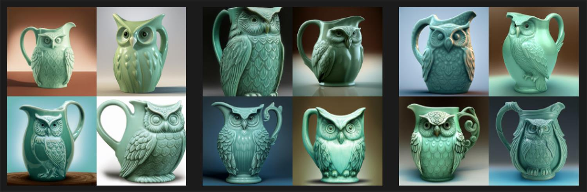


使用指定种子运行 3 次

提示示例：/imagine prompt celadon owl pitcher --seed 123

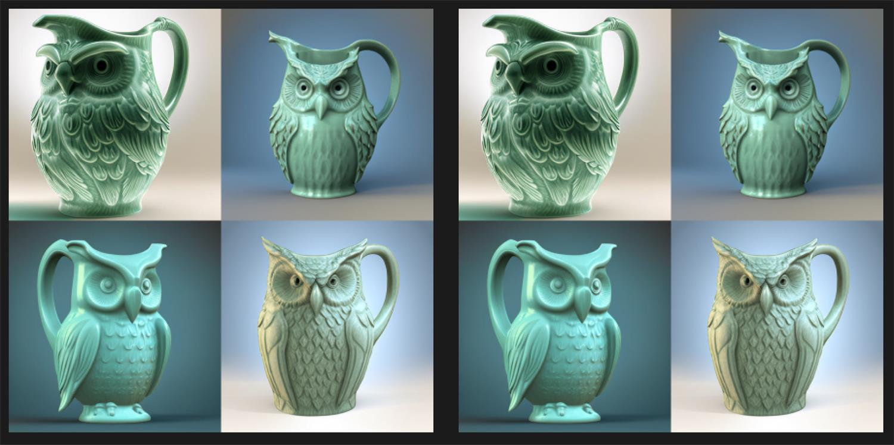

同数值参数

--seed 值创建一个大的随机噪声场，应用于初始网格中的所有图像。指定时--sameseed，初始网格中的所有图像都使用相同的起始噪声，并将生成非常相似的生成图像。

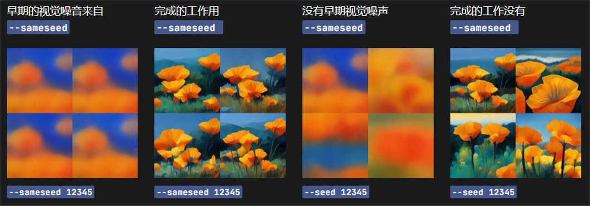

如何查找工作的种子编号

使用 Discord 表情符号反应，通过对工作使用 ☉️ 信封表情符号做出反应，在不和谐中找到工作的种子编号。

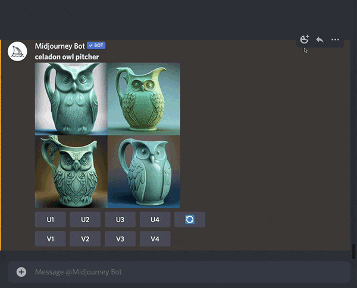

如何更改种子编号

使用 --seed 或--sameseed 参数，添加--seed 或--sameseed 到提示的末尾。


5）Shop（停止）

使用--stop 参数在流程中途完成作业。以较早的百分比停止作业会产生更模糊、更不详细的结果。

--stop 接受值：10–100。

默认--stop 值为 100。

--stop 时不起作用。

不同 Shop 的对比

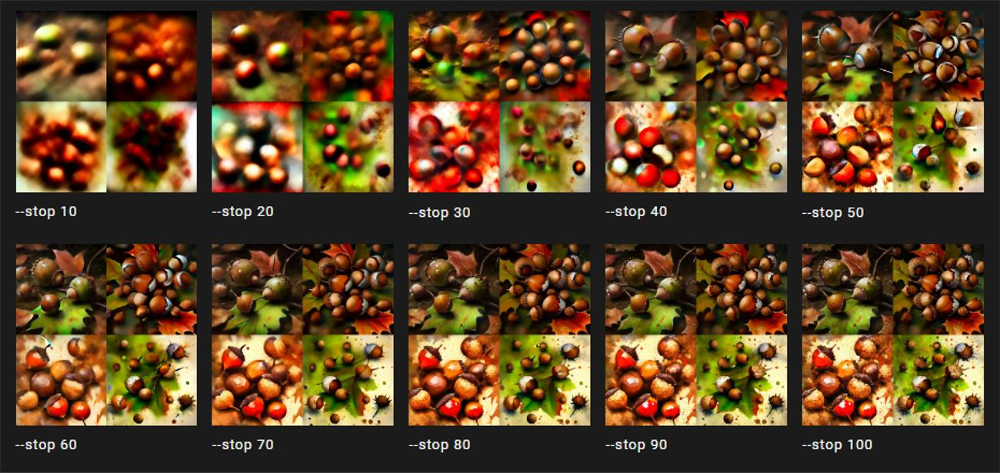

shop 和 Beta Upscale

放大时，该--stop 参数不会影响作业。但是，停止会产生更柔和、细节更少的初始图像，这将影响最终放大结果的细节水平。下面的放大图像使用了 Beta Upscaler。

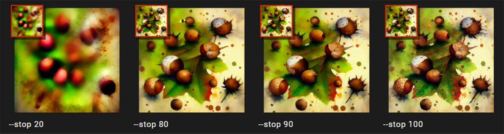

使用--stop 参数

添加--stop  < value > 到提示的末尾。


6）Stylize（程序化）

Midjourney Bot 经过训练可以生成有利于艺术色彩、构图和形式的图像。或参数影响该训练应用--stylize 的--s 强度。低程式化值生成的图像与提示非常匹配，但艺术性较差。高程式化值创建的图像非常具有艺术性，但与提示的联系较少。

--stylize 的默认值为 100，并且在使用默认 [V4 模型] 时接受 0-1000 的整数值。

不同的 Midjourney 版本模型具有不同的风格化范围。

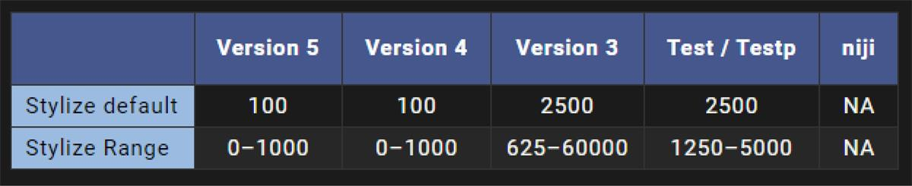

通用风格化设置

V4 模型

提示示例：/imagine prompt illustrated figs --s 100

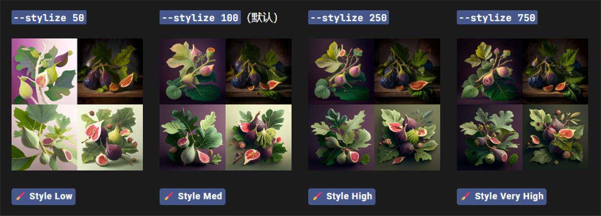


V5 模型

提示示例：/imagine prompt colorful risograph of a fig --s 100

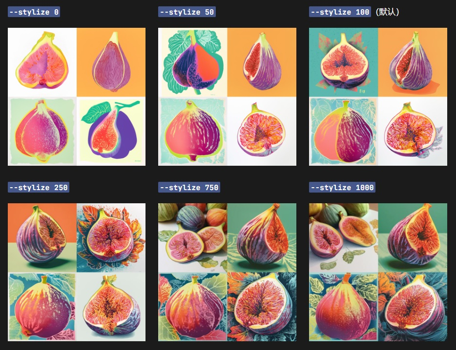

使用 stylize 参数

添加--stylize < value >或--s 到提示的末尾。


使用设置命令

/settings 从菜单中键入并选择您喜欢的风格化值。

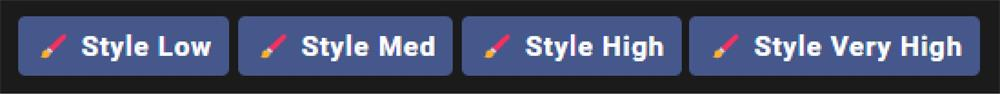

7）Tile（平铺）

--tile 参数生成可用作重复拼贴的图像，以创建织物、壁纸和纹理的无缝图案。

--tile 适用于模型 版本 1、2、3、5

--tile 只生成一个 tile。使用像这种无缝模式检查器这样的模式制作工具来查看拼贴重复。

Tile 示例

使用 Midjourney 的模型测试/Testp

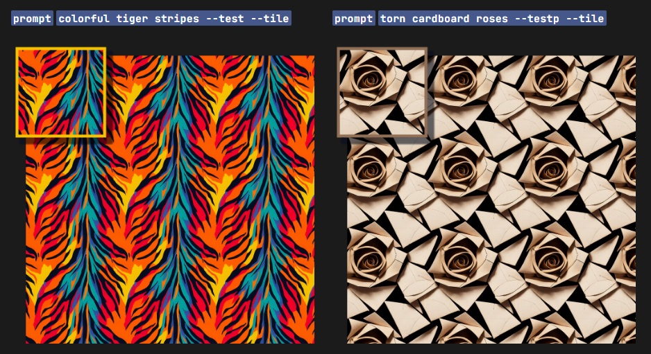

使用 Midjourney 模型 5

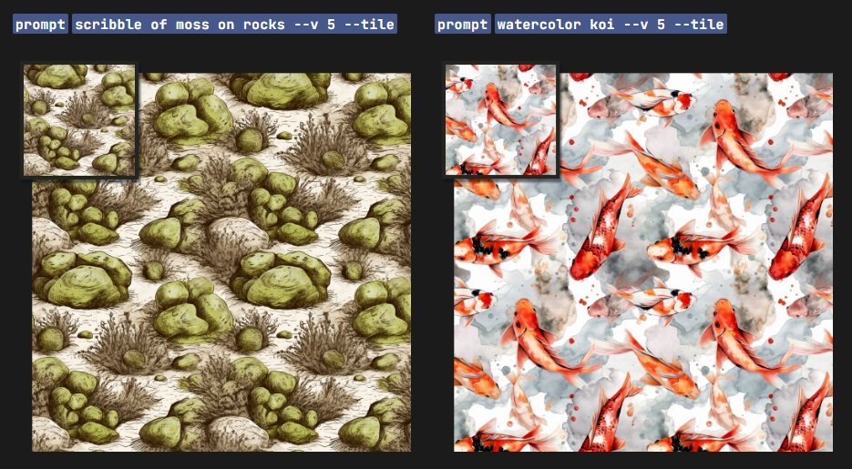

如何使用 tile 参数

添加--tile 到提示的末尾。


8）Version（版本）

Midjourney 定期发布新模型版本以提高效率、一致性和质量。默认为最新型号，但可以使用--version 或--v 参数或使用/settings 命令并选择型号版本来使用其他型号。不同的模型擅长处理不同类型的图像。

--version 接受值 1、2、3、4 和 5。

--version 可以缩写--v

最新模型（V5）

Midjourney V5 模型是最新最先进的模型，于 2023 年 3 月 15 日发布。要使用此模型，请将参数添加--v 5 到提示末尾，或使用/settings 命令并选择 5️⃣ MJ Version 5

该模型具有非常高的 Coherency，擅长解释自然语言提示，分辨率更高，并支持高级功能，例如重复模式--tile

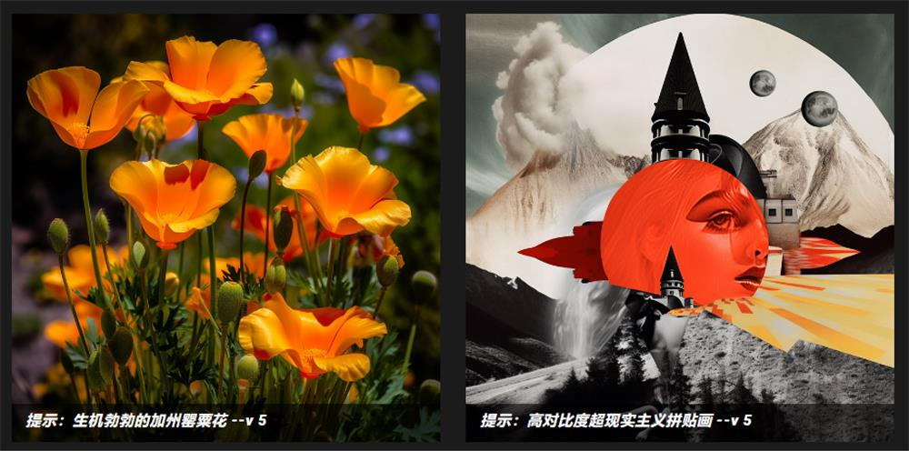

V4 模型

Midjourney V4 模型是由 Midjourney 设计并在新的 Midjourney AI 超级集群上训练的全新代码库和全新 AI 架构。最新的 Midjourney 模型拥有更多关于生物、地点、物体等的知识。它更擅长正确处理小细节，并且可以处理包含多个角色或对象的复杂提示。第 4 版模型支持图像提示和多提示等高级功能。

该模型具有非常高的 Coherency 并且在 Image Prompts 方面表现出色。

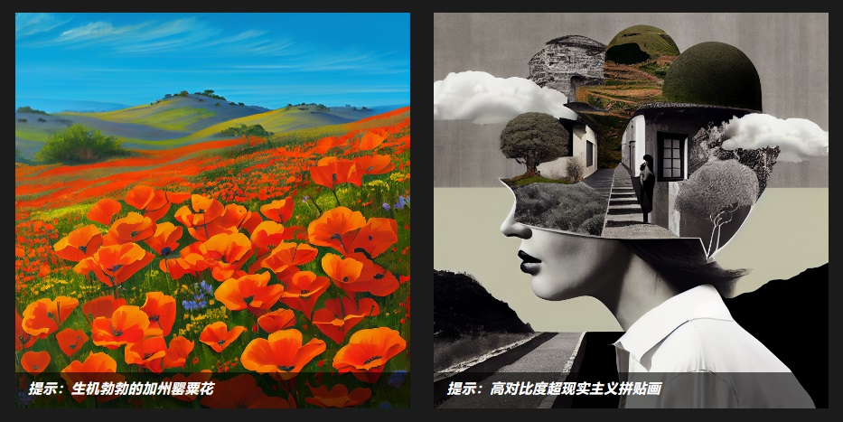


V4 的 样式 4a、4b 和 4c

Midjourney Model Version 4 具有三种略有不同的“风格”，对模型的风格调整进行了细微调整。通过在 V4 提示末尾添加--style 4a、--style 4b 或来试验这些版本。--style 4c

--v 4 --style 4c 是当前默认值，不需要添加到提示末尾。

关于样式 4a 和 4b 的注释

--style 4a 且--style 4b 仅支持 1:1、2:3 和 3:2 纵横比。

--style 4c 支持高达 1:2 或 2:1 的纵横比。

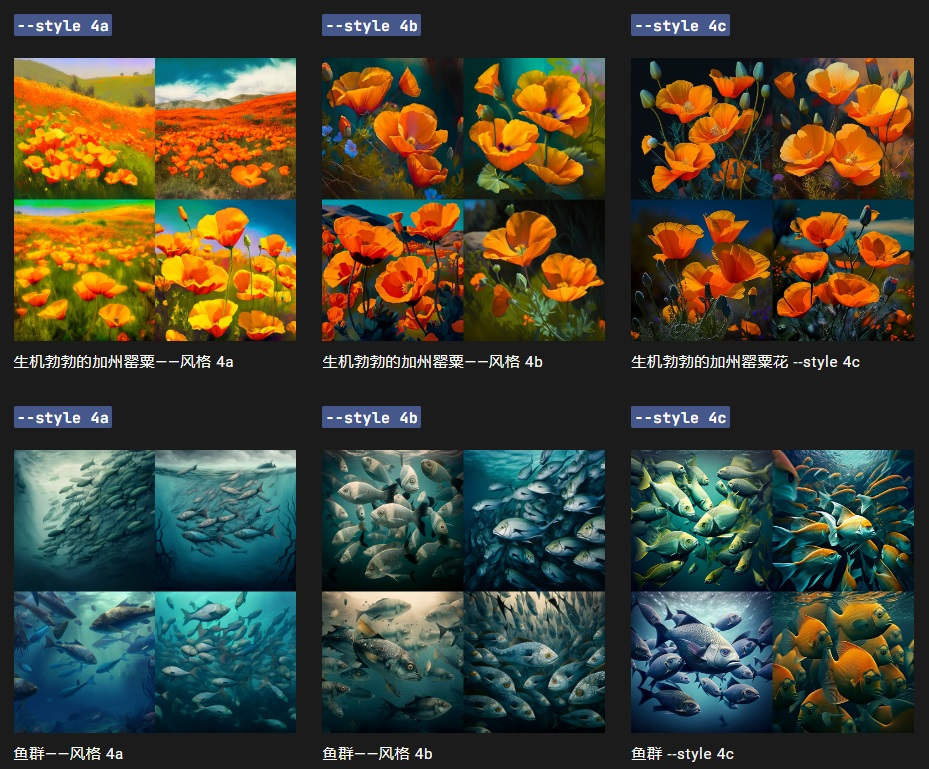

以前的模型

您可以使用--version 或--v 参数或使用/settings 命令并选择模型版本来访问更早的 midjourney 模型。不同的模型擅长处理不同类型的图像。

提示示例：/imagine prompt vibrant California poppies --v 1

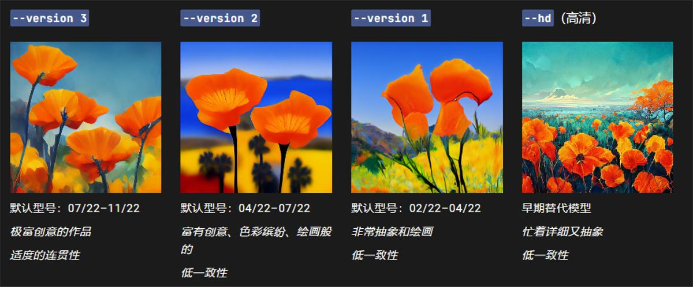

Niji 模型

该模型是 Midjourney 和 Spellbrushniji 之间的合作，经过调整可以制作动画和插图风格。该模型对动漫、动漫风格和动漫美学有更多的了解。一般来说，它在动态和动作镜头以及以角色为中心的构图方面表现出色。--niji

提示示例：/imagine prompt vibrant California poppies --niji

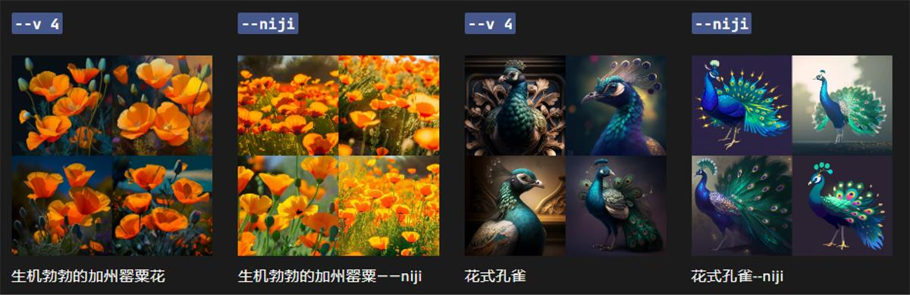

--niji 型号 说明

Niji 不支持--stylize 参数。使用/settings 命令并选择 Style Med 重置为所有--niji 提示的默认样式设置。Niji 支持多提示或图像提示。

Test 模型

偶尔会临时发布新模型以供社区测试和反馈。目前有两种可用的测试模型：--test 和--testp，它们可以与--creative 参数结合使用以获得更多不同的成分。

提示示例：/imagine prompt vibrant California poppies --testp --creative

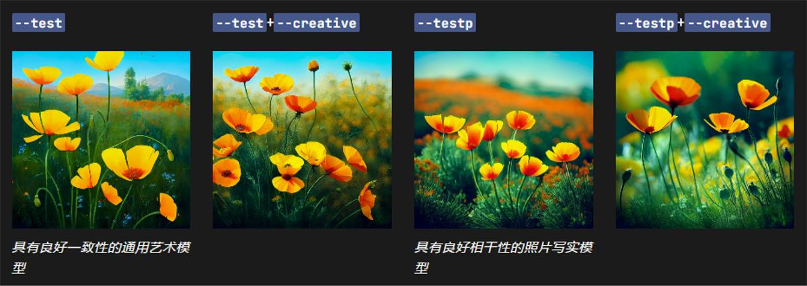

当前测试模型的注释--test 和--testp

测试模型仅支持--stylize1250–5000 之间的值。

测试模型不支持多提示或图像提示

测试模型的最大纵横比为 3:2 或 2:3。

当宽高比为 1:1 时，测试模型仅生成两个初始网格图像。

当纵横比不是 1:1 时，测试模型只生成一张初始网格图像。

靠近提示前面的词可能比靠近后面的词更重要。

使用版本或测试参数

将--v 1, --v 2, --v 3, --v 4, --v 4 --style 4a, --v4 --style 4b --test, --testp, --test --creative,--testp --creative 或添加--niji 到提示的末尾。

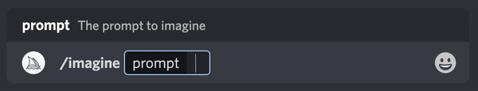

使用设置命令

输入/settings 并从菜单中选择您喜欢的版本。

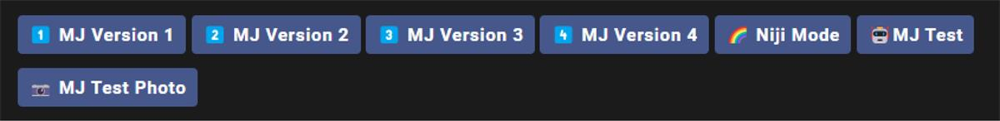

9）Video（视频）

使用该--video 参数创建正在生成的初始图像网格的短片。使用信封 ☉️ 表情符号对完成的工作做出反应，让 Midjourney Bot 将视频链接发送到您的直接消息。

--video 仅适用于图像网格，不适用于高档。

--video 适用于模型版本 1、2、3、test 和 testp。

视频示例

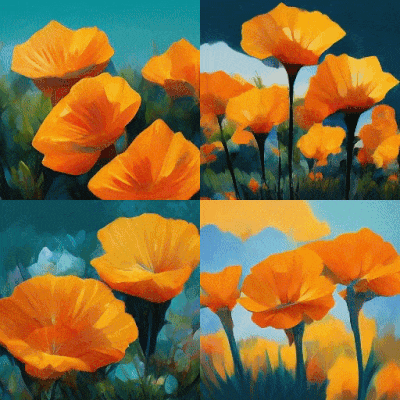

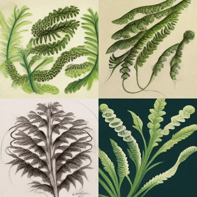

如何获取视频链接

提示示例：/imagine prompt Vibrant California Poppies --video

① 添加--video 到提示的末尾；

② 作业完成后，单击添加反应；

③ 选择 ☉️ 信封表情符号；

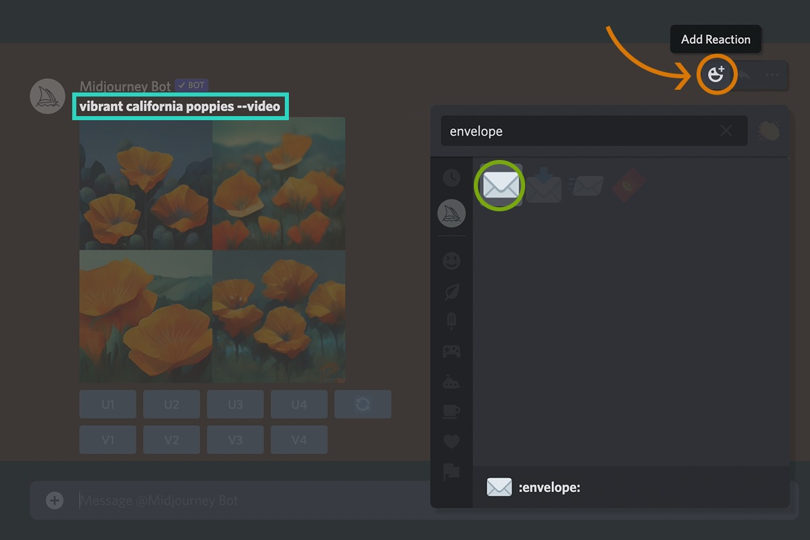


④ Midjourney 机器人会将视频链接发送到您的直接消息；

⑤ 单击链接可在浏览器中查看您的视频。右键单击或长按以下载视频；

如何使用视频参数

添加--video 到提示的末尾。

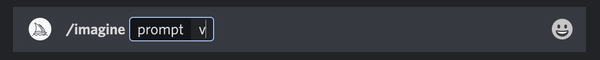


# 绘画案例分享

## 1）插画风格
> 来自外星的兔子
> 
> 关键词：
> photo of a rabit monster in the space, style of laurie greasley, studio ghibli, akira toriyama, james gilleard, genshin > > impact, trending pixiv fanbox, acrylic palette knife, 4k, vibrant colors, devinart, trending on artstation, low details
> 
> 空间中的兔子怪物照片，劳里·格里斯利，吉卜力工作室，鸟山明，詹姆斯·吉勒德的风格，源信冲击，流行 pixiv 风扇盒，亚克力色板刀，4k，充满活> 力的颜色，devinart，在 artstation 上流行，低细节

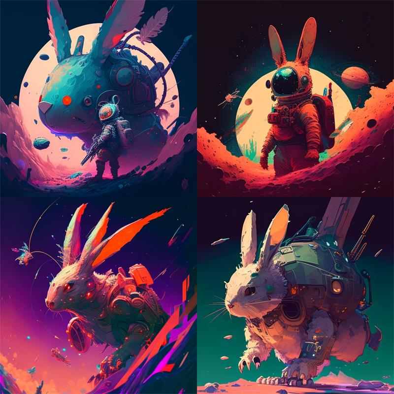

> 矢量插画
> 
> 关键词：
> Vector illustration, Flat illustration, Illustration, man working on the table with laptop, Trending on Artstation, > Popular on Dribbble, Cozy wallpaper, Pastel colors
> 
> 矢量插图，平面插图，插图，用笔记本电脑在桌子上工作的人，在 Artstation 上的趋势，在 Dribbble 上的流行，舒适的壁纸，柔和的颜色

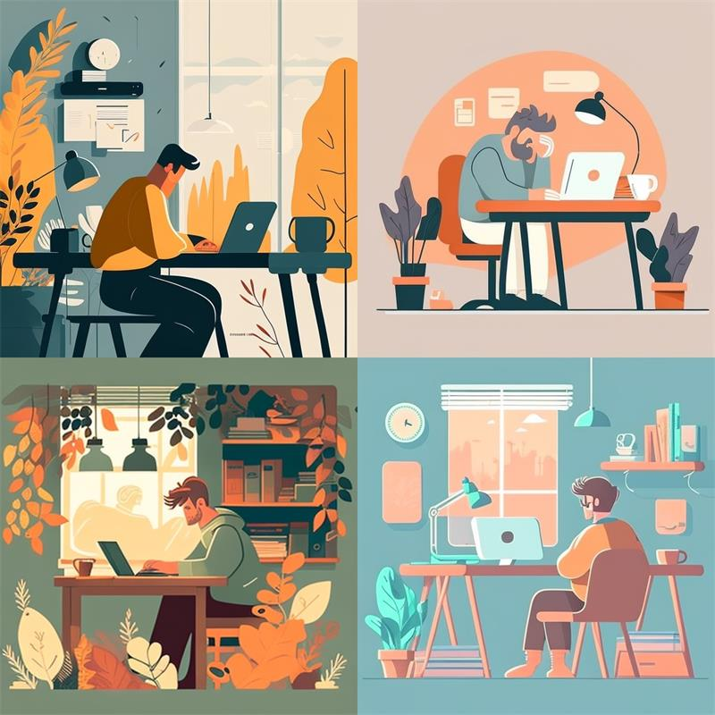

> 数字插画
> 
> 关键词：
> Vector illustration, Minimalistic, Digital illustration, Hacker wearing a hoodie and a face mask working on a computer, T-shirt design, Dramatic Lighting, Trending on Artstation, Award winning, Icon, Highly detailed
> 
> 矢量插图，极简主义，数字插图，黑客穿着卫衣和口罩在电脑上工作，t 恤设计，戏剧性的照明，艺术展上的趋势，获奖，图标，高度详细
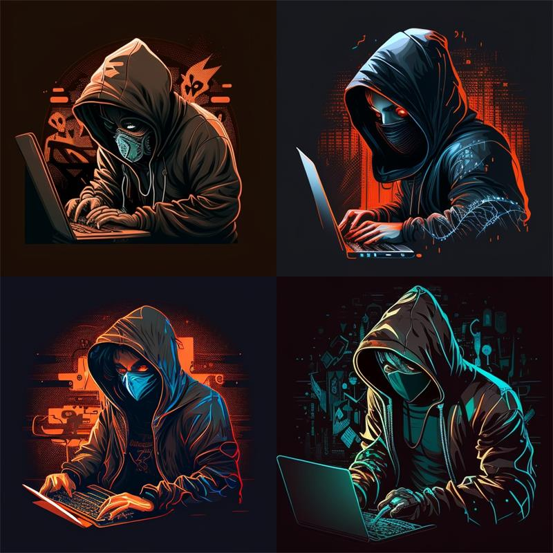


## 2）电影风格

> 空中岛屿
> 
> 关键词：
> A communist city, stablished on flying islands that have mechanisms in the bottom, seen from below the flying islands and afar, soft color palette, movie style, Cinematic, Photography, Sharp, Hasselblad, Dramatic Lighting, Depth of field, Medium shot, Soft color palette, 80mm, Incredibly high detailed, Lightroom gallery
> 
> 一个共产主义城市，建立在飞行的岛屿上，在底部有机制，从飞行的岛屿下面和远处看，柔和的调色板，电影风格，电影，摄影，锐利，哈苏，戏剧性的灯光，景深，中等镜头，柔和的调色板，80mm，高细节，Lightroom 画廊

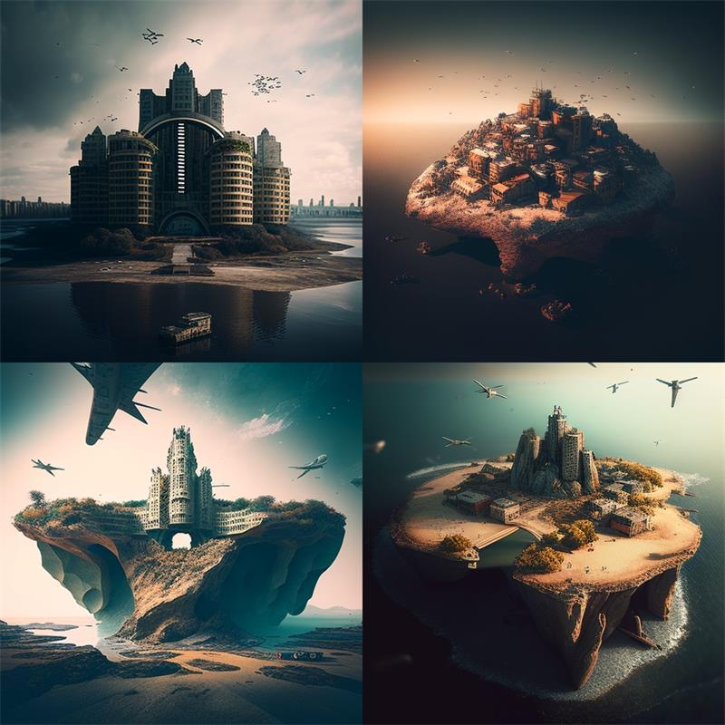

> 赛博朋克黑暗幻想
> 
> 关键词：
> Neuromancer, cyberpunk, Apocalypse, Dark fantasy, Cityscape, 8k wallpaper, Dark color palette, Hieronymus Bosch, H, R, Giger
> 
> 神经漫游者，赛博朋克，天启，黑暗幻想，城市景观，8k 壁纸，深色调色板，耶罗尼米斯·博斯，H, R，吉格尔

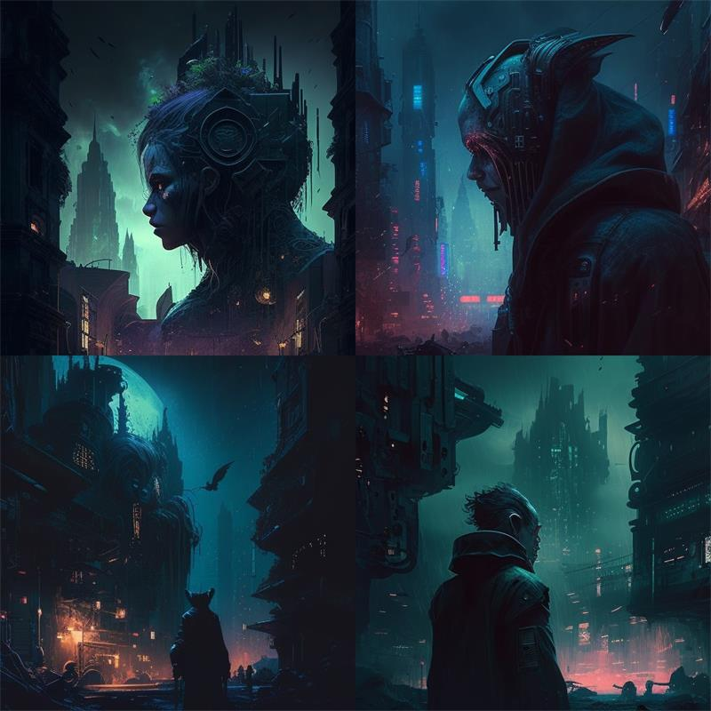

> 山底小木屋
> 
> 关键词：
> A wooden cabin on an alpine montain, outside view with look into a valley, autumn wheater and sun, Realistic, Intricately detailed, Cinematic composition, Cinematic lighting, Lightroom gallery, Behance contest winner, Professional photography, Unsplash, Low angle
> 
> 高山上的木屋，可以看到山谷，秋天的小麦和太阳，现实主义，复杂的细节，电影构图，电影照明，Lightroom 画廊，Behance 大赛冠军，专业摄影，无飞溅，低角度

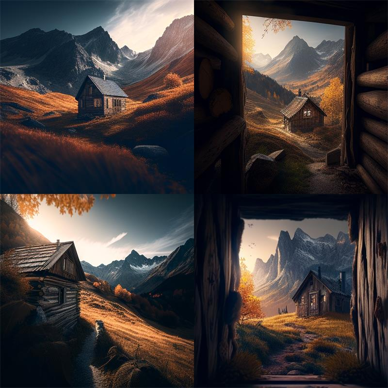

## 3）3D 风格

> 可爱的卡通兔子
> 
> 关键词：
> 3d cartoon style cute rabbit character with a happy face, future, funko pop, 3d, Hyper realistic
> 
> 3d 卡通风格的可爱的兔子角色，有一个快乐的脸，未来，Funko 流行，3D，超现实的

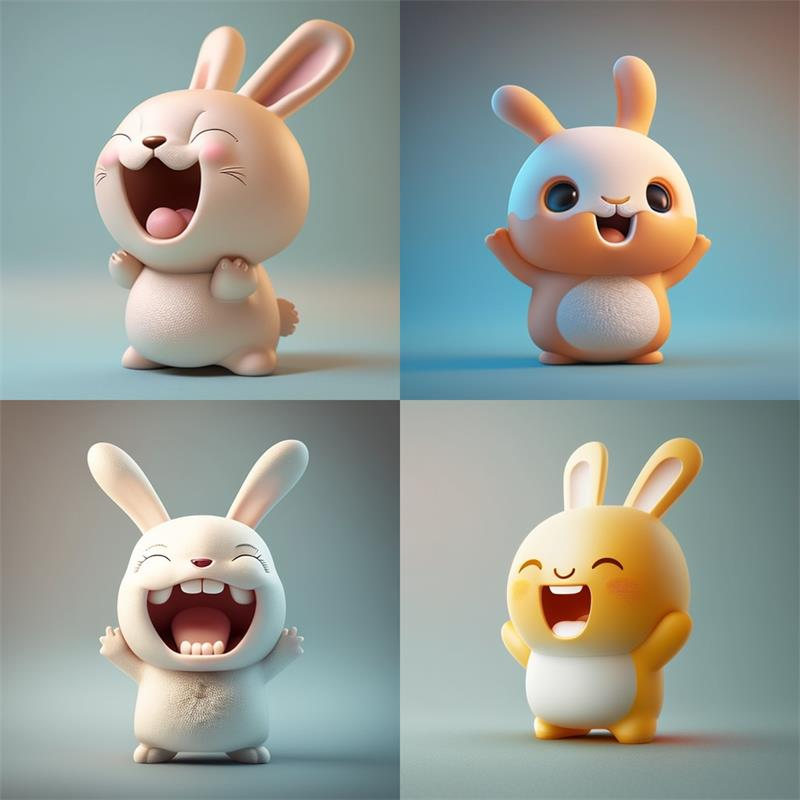

> 太空宇航员
> 
> 关键词：
> Tiny, Cute, small, An astronaut in space with distant planets in the background, Miniature, Diorama, Orthographic view, Cinematic lighting, Gediminas Pranckevičius, Giuseppe Arcimboldo, Goro Fujita, Intricate, Hyp er detailed, 4k
> 
> 微小，可爱，小，宇航员在太空中与遥远的行星为背景，微缩，立体，正投影视图，电影照明，Gediminas pranckeviius, Giuseppe Arcimboldo，藤田五郎，复杂，Hyp er 细节，4k

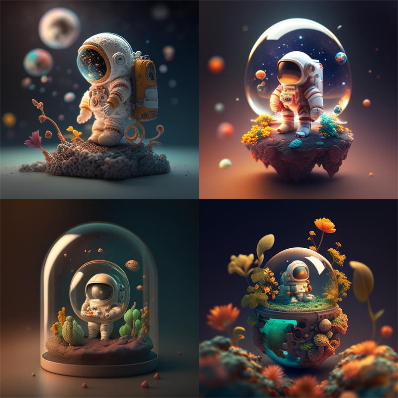

> 超写实主义机器人
> 
> 关键词：
> Hyperrealism, Hyper detailed, Cute, Sci-fi, 3D, cute, robot assistant made of thunder, loveable, Disney character, friendly, cute, Simple, Icon, Popular on Dribbble, Dieselpunk, High-end, Realistic textures, Centered
> 
> 超写实主义，超细节，可爱，科幻，3D，可爱，机器人助手，雷，可爱，迪士尼人物，友好，可爱，简单，图标，流行 Dribbble, Dieselpunk，高端，现实纹理，居中

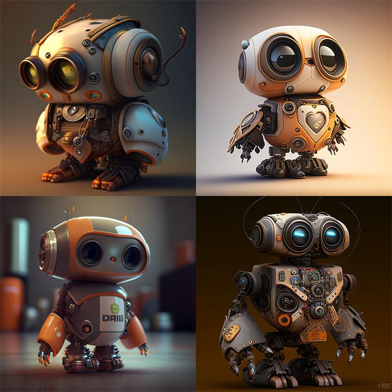
