# Introduction
Midjourney is an artificial intelligence program and service created and hosted by a San Francisco-based independent research lab Midjourney, Inc. Midjourney generates images from natural language descriptions, called "prompts", similar to OpenAI's DALL-E and Stable Diffusion.

The tool is currently in open beta, which it entered on July 12, 2022. The Midjourney team is led by David Holz, who co-founded Leap Motion. Holz told The Register in August 2022 that the company was already profitable. Users create artwork with Midjourney using Discord bot commands.

Midjourney 是由位于旧金山的独立研究实验室Midjourney，Inc.创建和托管的人工智能程序和服务。Midjourney通过自然语言描述（称为“提示”）生成图像，类似于OpenAI的DALL-E和Stable Diffusion。

目前架设在 Discord 频道上。于 2022 年 7 月 12 日进入公开测试阶段，使用者可通过 Discord 的机器人指令进行操作，可以创作出很多的图像作品。

# Homepage

# How to use
### Discord
> Discord 是前几年诞生的非常火的一种新型聊天工具，类似 QQ、微信群。
> Midjourney 的使用方式是：通过给 Discord 频道内的聊天机器人发送对应文本，聊天机器人返回对应的图片。
> 想想用 Midjourney，需要先注册一个 discord 账号，然后进入 Midjourney 的 Discord 频道。详细步骤参考下面内容。

简短篇

访问 Midjourney 官方网站：https://www.midjourney.com/
1. 点击页面上的“Start Your Journey”按钮，进入注册页面。
2. 在注册页面上填写您的用户名、电子邮件地址和密码，然后点击“注册”按钮。您还可以使用 Google 或 Facebook 账号进行注册。
3. 注册后，您将被引导进入 Midjourney 的主界面。您可以在主界面上看到自己的聊天记录和其他功能选项。
4. 如果您想开始一次新的聊天，可以点击屏幕左下角的“新聊天”按钮。
5. 接下来，您需要选择聊天的主题。Midjourney 支持的主题包括压力、情感、自我成长等等。
6. 选择主题后，您将进入聊天室。在聊天室中，您将与一位 AI 对话，您可以在聊天过程中分享自己的情感和经历。
7. 与 AI 聊天时，尽可能详细地描述自己的情感和感受，这有助于 AI 更好地理解您的需求并提供更准确的建议。
8. 在聊天结束后，您可以查看聊天记录并将其保存到您的个人档案中，以便以后回顾和分析。

 

### 注册账号
Midjourney 是Discord上面的一个对话机器人，相当于微信的一个群主或者一个公众号，所以这里我们要先注册 Discord, 再加入Mid的群聊，就可以啦：

打开 Midjourney 网站之后，点击 “sign in”。（如果你已经注册了账号，点击“join the beta”会自动进入到“discord，新用户就不用搭理这个啦）

  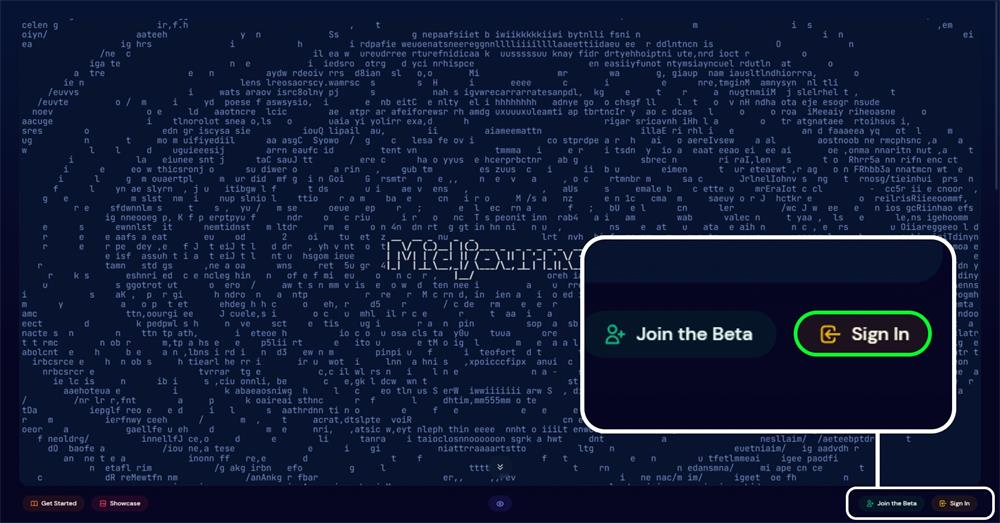

点击“sign in” 后会出现这个登录界面，点击下方的“注册”按钮，然后弹出一个填写信息框，大家按照要求去填写就好了。

注意！！！

邮箱：建议用国外的邮箱，国内邮箱不一定能注册 Discord；

用户名：咱用国外的软件建议还是用些英文名比较好，Discord 社区大部分都是国外友人，当然这个不强求，名字取的简单一点吧，不用搞的太复杂；

密码：用自己常用的的密码吧，不然容易忘（本人），密码可以复杂点，避免出现不可控因素；

出生日期：年龄填 18 岁以上的，也不要填的很离谱，万一人家做限制什么的；

  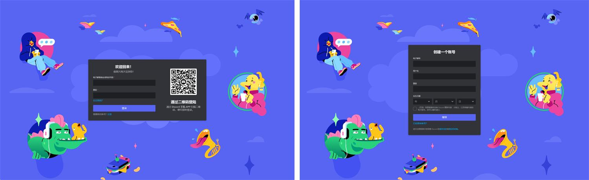

然后就是进行人机验证了，根据要求去填写信息，之后你的邮箱就会收到验证信息，按要求点击就好了。

  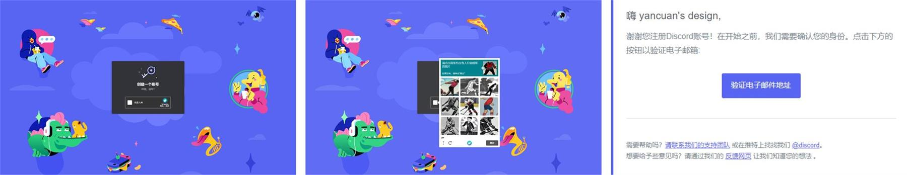

注意的是，如果填写信息之后出现错误（如左 1 也可能是其他的错误方式展示），不要着急，等邮箱收到验证信息确定之后就好了，未收到信息之前什么也不用做。最后就是授权登录就大功告成了。

  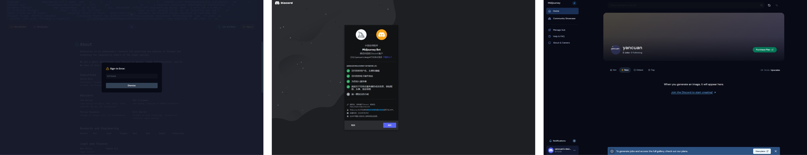

Discord 是可以下载客户端和 app 端的，看自己的习惯和需求进行选择。[Discord下载](https://discord.com/download)

### 加入Midjourney的聊天

注册完账号并在[Midjourney 网站]登陆之后，网站会跳转到[充值界面](https://www.midjourney.com/app/)

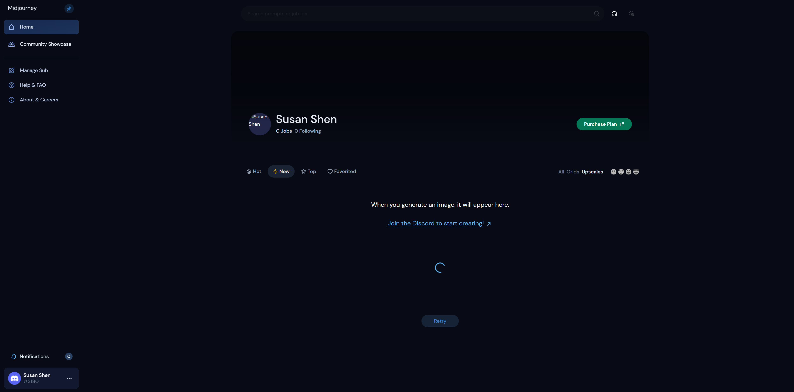

点击中间的`Join the Discord to start creating`。 网页会跳转出来邀请你加入Midjourney频道，点击确认，就可以在左侧看见Midjourney 的群组了【左侧边栏像小白帆船一样的logo就是他的服务】

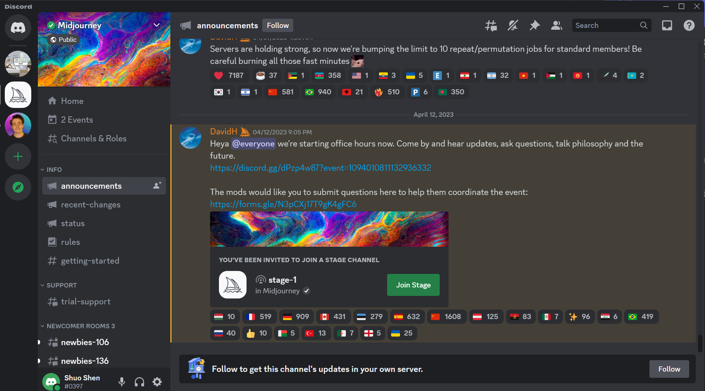

点进去会出现一大堆信息，这个社区是公开的，很多人都在这里做图，左侧的一栏是该服务器频道，有 Midjourney 管理人员的频道，发布一些更新信息等，还有公众的作图频道，我建议可以在里面看看人家怎么给关键词做图的，不建议在这里生成自己的图，太多信息了。。

这些前面带着`#`的就是频道了。

  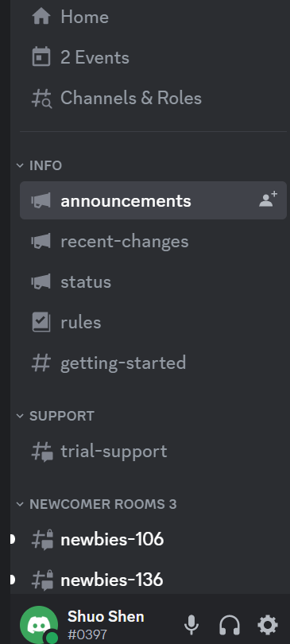

 

> 如果邀请没有跳转出来。就点击左侧“探索公开服务器”这个按钮（左侧这一排的功能都是服务器功能，“我”所在的服务器）。这里有很多公共的App，如果你想了解其他服务可以自己探索，就是第一个 Midjourney，然后点进去吧（出现这个欢迎弹窗，咱不管它）。
>
>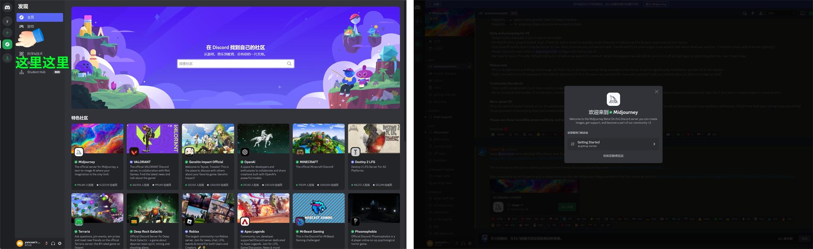
>
> 加入社群就是点击这个加入
>
>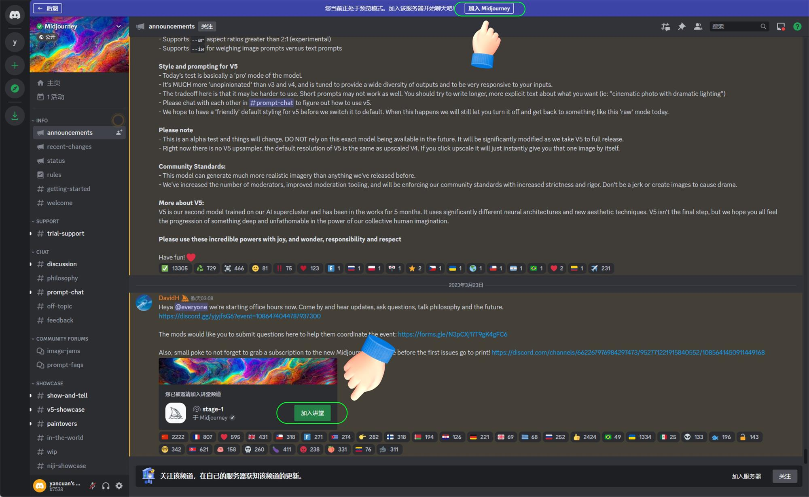

注意：这里可能验证一遍之后你并没有加入社区，可能是网络原因，影响不大，重复验证一遍即可（一次过的忽略）下面是加入成功之后的界面：

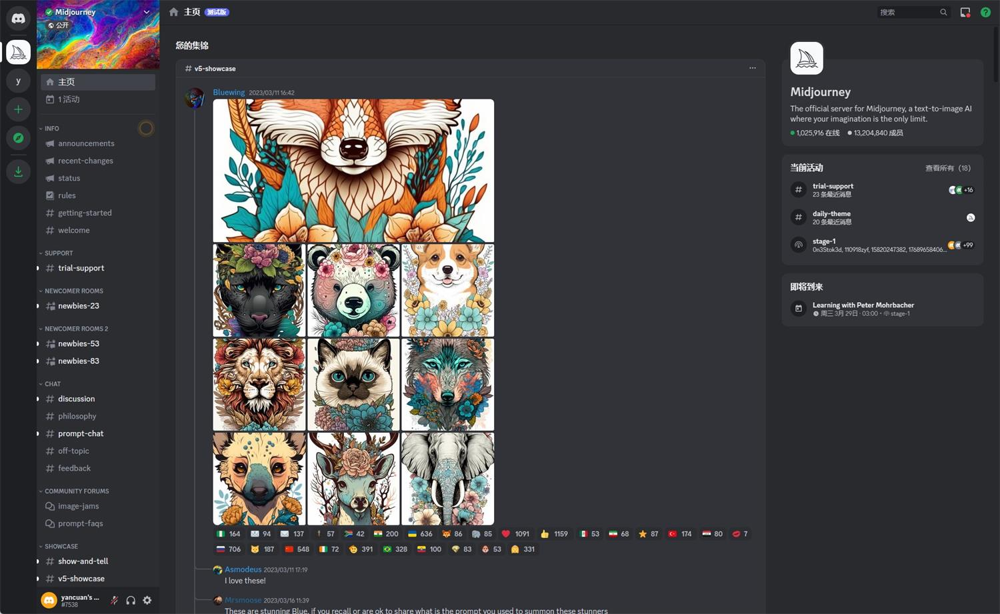

然后我们切换下频道，频道这边的随便点击一个，然后点击右边顶部的“成员名单”按钮（注意哦，需要点击下面的一个频道才会显示“成员名单”按钮）：

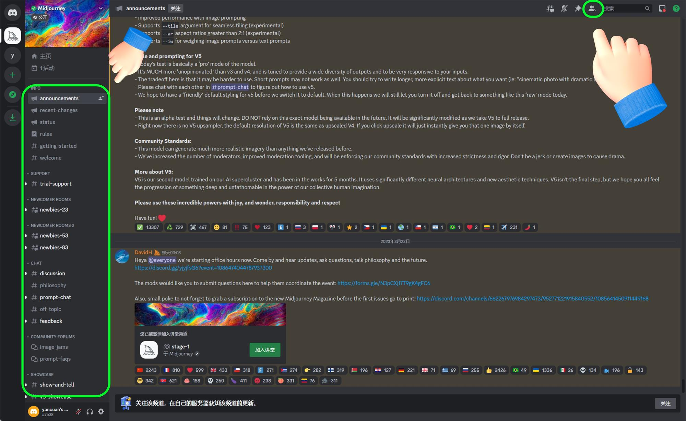

 

### 创建与Midjourney对话的服务

进入到“Discord”界面，在左侧边栏【Midjourney头像的下方】有一个加号，点击就会出现创建服务器的弹窗.

  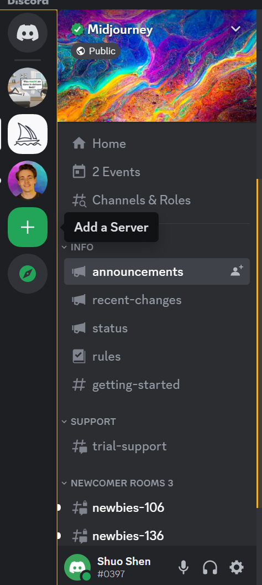

然后点击“亲自创建”，选择“仅供我和我的朋友使用”，创建服务器名称，头像可以是官方默认的（可以不填），后面的信息就随便填写啦，填写完成之后进入我们的服务器，那么创建服务器就大功告成了。

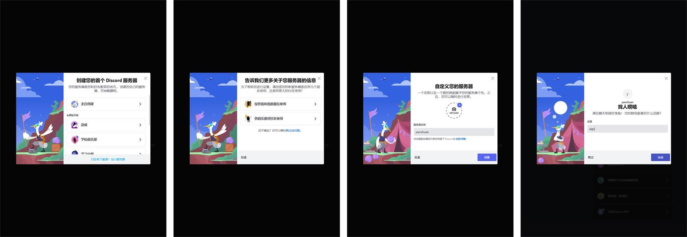
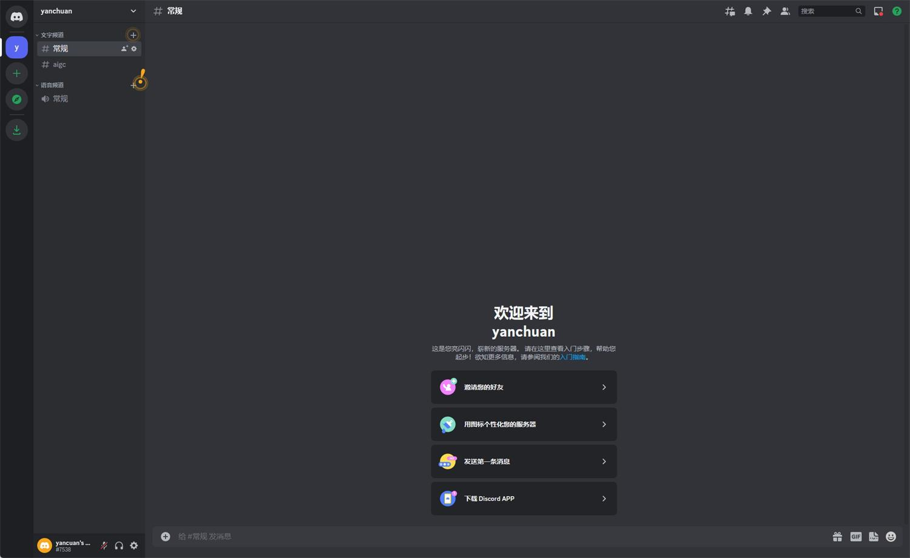
这边有部分同学进来可能是英文界面的，莫慌！跟着我接下来的操作：

点击左下角个人信息的设置按钮，找到“language”这个选项，然后选择“中文”，就完事了，那我们继续讲后面的：
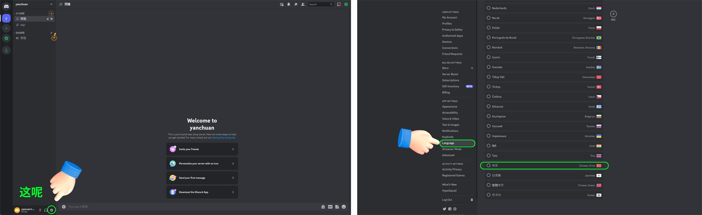

> 下一步：在你的频道中添加Midjourney机器人【相当于添加他的好友】

点击`下载Discord APP` 或者 `add your first APP` 会跳出来一个弹窗，不用管他，点击`check it out`, 之后就会进入APP搜索界面。
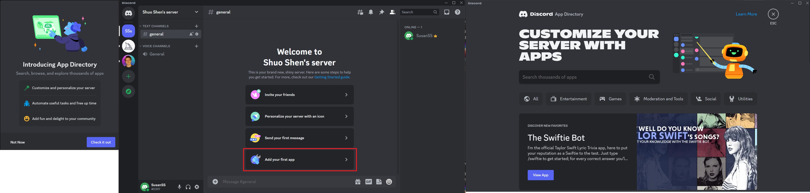

输入`Midjourney`，再按回车键，就会看到搜索结果。点击第一个`Midjourney Bot`，点击 `add to server`。 之后会跳出来授权，不用理会，只要确认就行。最后回到你的频道，你就会看到对话框里写着`Welcome Midjourney Bot. Say hi!`, 大功告成了，你可以开始使用Midjourney做图！
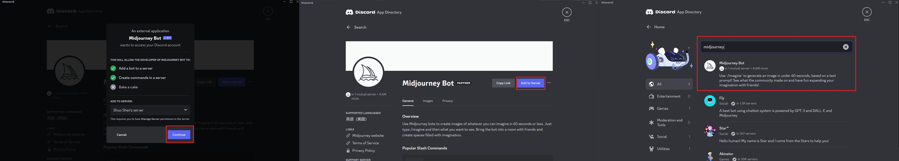
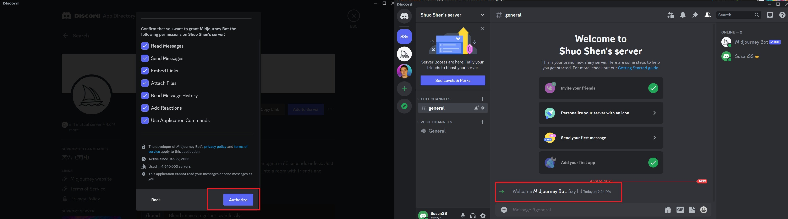

### 会员付费
Midjourney 给予普通用户的免费做图已经取消了。如果是想好好的研究学习 Midjourney，并且用在工作中，那咱还是跳不掉付费这个流程。

我们回到 Midjourney 页面，这个链接： https://www.midjourney.com/app/

点击左侧的“Manage Sub”，订阅的种类如下，可以用浏览器翻译一下查看信息，这里我们一般按月付的方式（大佬忽略我这句话，自行选择月/年付），月付的价格会比年费贵点。我建议的是大家要付费就选择“Standard Plan”的方式，也就是 30 美金/月，10 美金可用的图片数量是不够用的，大家可以对比下：

- 10 美金：每月可以生成 200 张图片，适合轻度使用者。
- 30 美金：每月生成的图片无限制，每月 15 小时的 fast 使用时长。
- 60 美金：每月生成的图片无限制，每月 30 小时的 fast 使用时长。

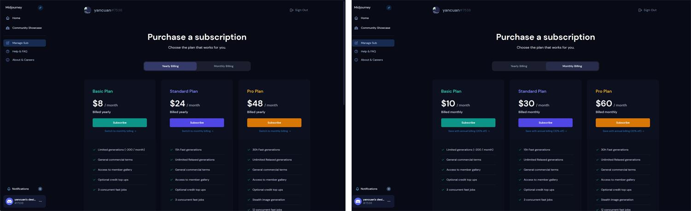

会员充值需要境外信用卡，如果没有可以联系我帮助你。

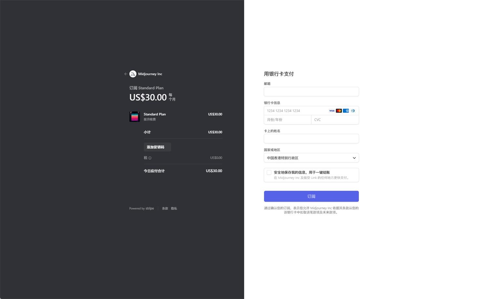

# 如何调教请看： - [Midjorney调教指南](./prompts.md)

# Others
- [Best Midjourney Prompts: an epic list of 644 crazy text to image ideas](https://www.creativindie.com/best-midjourney-prompts-an-epic-list-of-crazy-text-to-image-ideas/)
- [Midjourney基础教程](https://www.uisdc.com/midjourney-7)
