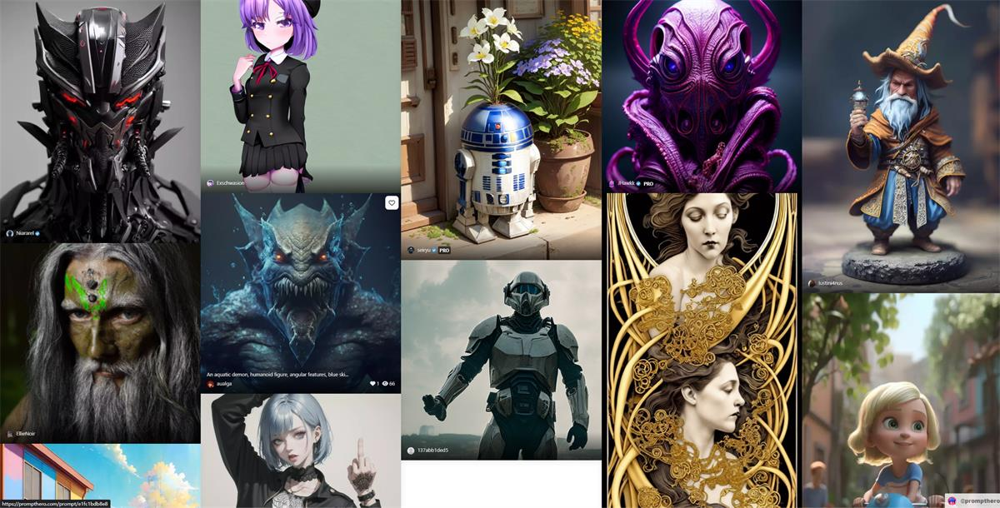
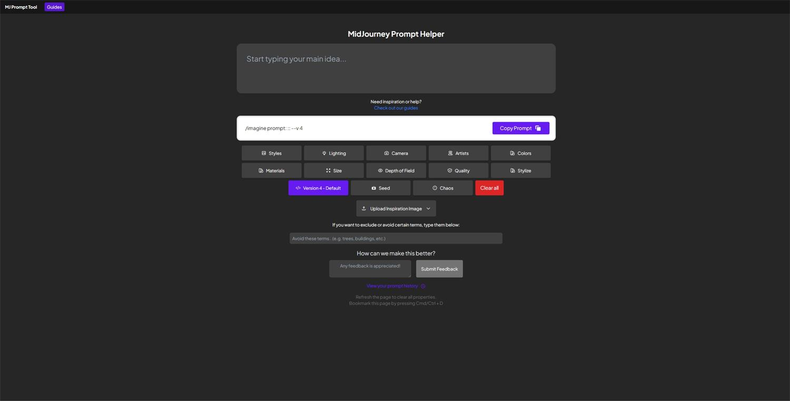
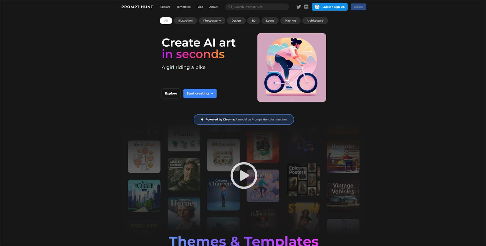
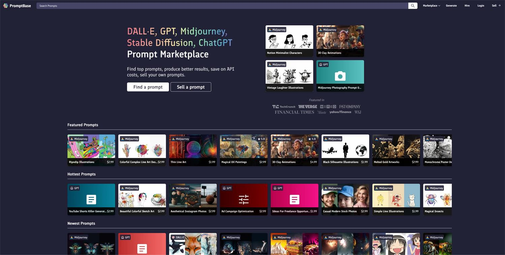
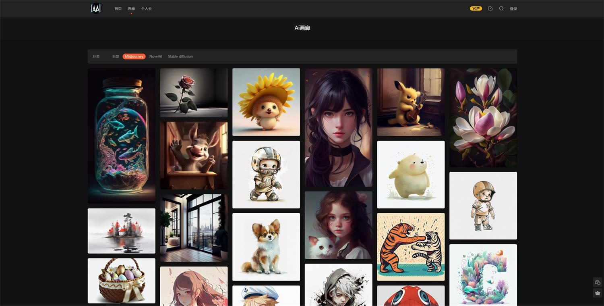
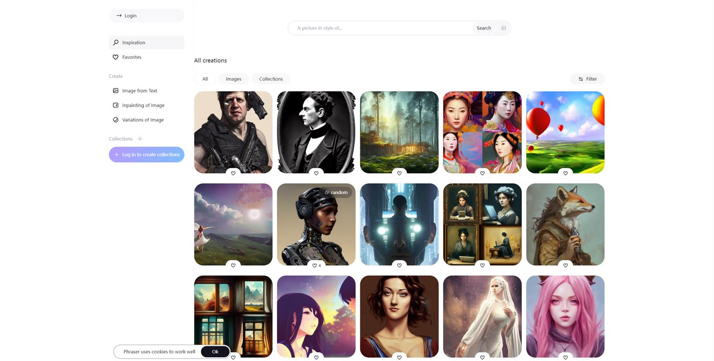
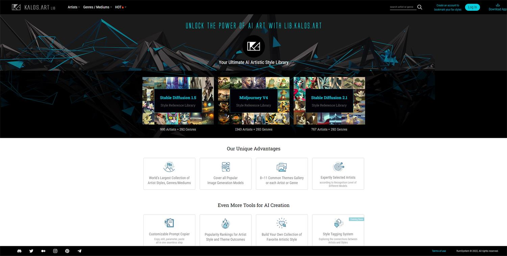
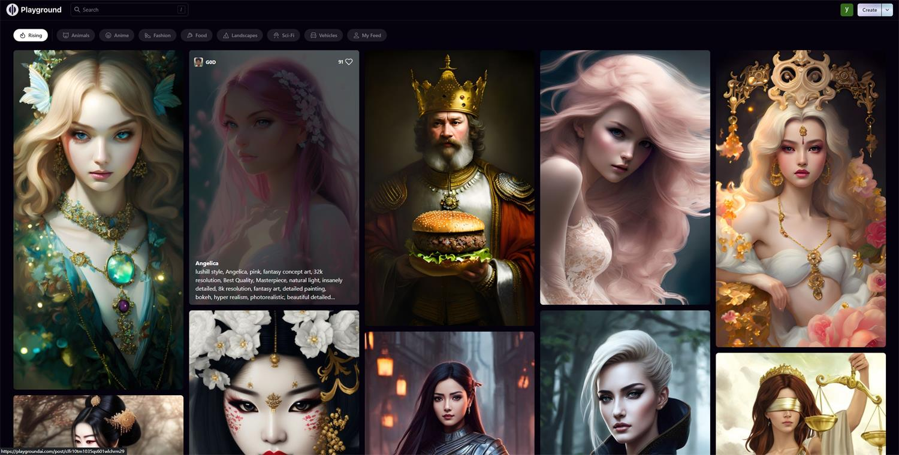
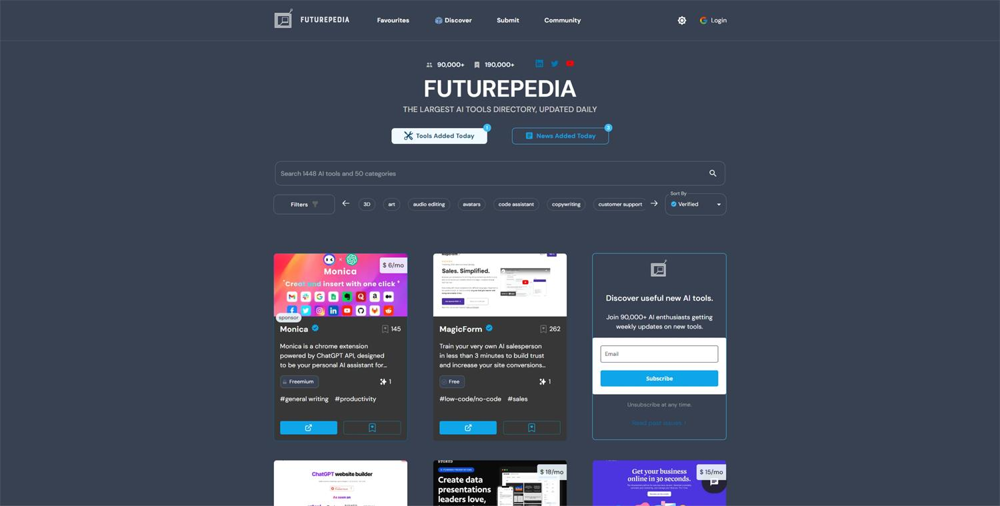
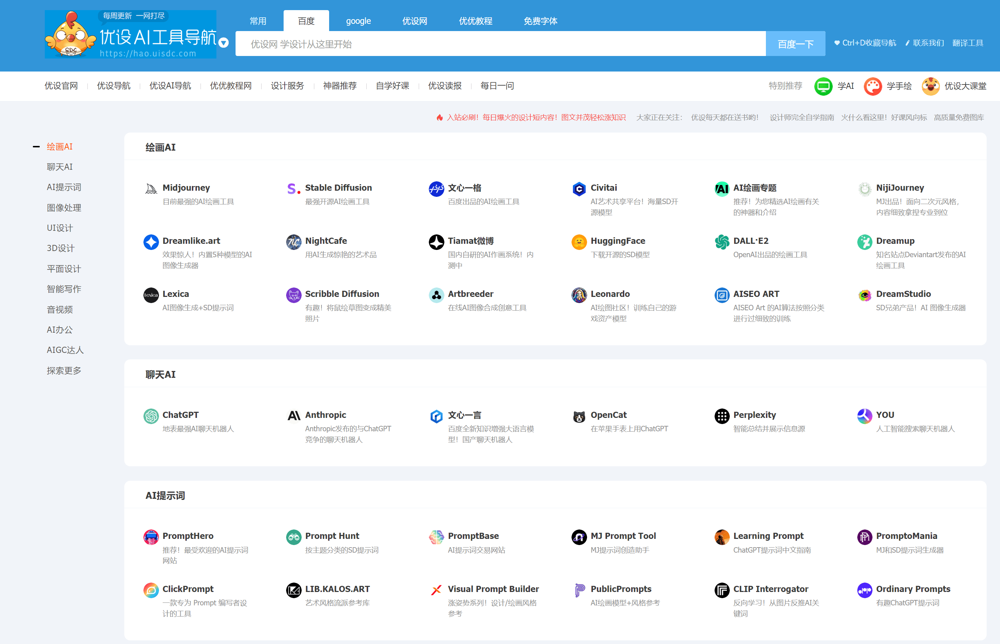

# AI-Powered Platforms and Tools
This repository contains information on various AI-powered platforms and tools that are designed to help users save time and resources. These platforms use artificial intelligence to automate tasks that would otherwise be performed by humans, providing users with personalized and efficient solutions.

## Contents
- Typeface
- Do Not Pay
- Converse by B7 Labs
- Spellbook
- Ad Creative
- Langotalk
- PowerMode
- Room GPT

>## [Typeface](https://www.typeface.ai/)
>Typeface is an artificial intelligence platform that provides customized content for enterprise end-users. By analyzing user data, the platform can generate personalized content, such as reports and presentations, in a matter of seconds. This can save companies time and resources by automating tasks that would otherwise be performed by human workers.

>## [Do Not Pay](https://donotpay.com/)
>Do Not Pay is an AI-powered platform that helps individuals fight legal battles without the need for a human lawyer. The platform offers a wide range of legal services, such as filing lawsuits, disputing parking tickets, and canceling subscriptions. With just a few clicks, users can get the help they need to fight for their rights.

>## [Converse by B7 Labs](https://b7labs.co/converse)
>Converse by B7 Labs is an AI-powered platform that helps users save time by summarizing lengthy web pages. By simply entering a URL, users can get a condensed version of the page's content, making it easier to digest and understand. This can be particularly useful for those who need to consume a large amount of information in a short amount of time.

>## [Spellbook](https://www.spellbook.legal/)
>Spellbook is an AI-powered platform that generates legal contracts for businesses. By automating the contract drafting process, Spellbook can save companies time and resources that would otherwise be spent on hiring a human lawyer. The platform is designed to be user-friendly, with contracts generated directly in Microsoft Word.

>## [Ad Creative](https://www.adcreative.ai/)
>Ad Creative is an AI-powered platform that generates high-converting ads and social media content. By analyzing user data, the platform can generate personalized content that is more likely to resonate with the target audience. This can help businesses increase their conversion rates and drive more sales.

>## [Langotalk](www.langotalk.org)
>Langotalk is an AI-powered language learning platform that allows users to practice speaking with an AI chatbot. The chatbot uses natural language processing to understand and respond to user input, providing real-time feedback and corrections. By practicing with Langotalk, users can improve their language skills up to six times faster than traditional methods.

>## [PowerMode](https://powermodeai.com/)
>PowerMode is an AI-powered platform that helps startups create pitch decks using GPT models. By analyzing user data, the platform can generate personalized pitch decks that are tailored to the needs of the user's target audience. This can help startups increase their chances of securing funding and growing their businesses.

>## [☘️ Room GPT](https://www.roomgpt.io/)
>
>Room GPT is an AI-powered platform that helps users redesign their rooms by uploading a photo. By using GPT models to analyze the photo, the platform can generate personalized design recommendations that are tailored to the user's preferences. This can help users save time and resources by providing them with a visual representation of their room before making any physical changes.

>## [AI 提示词（Prompt）工具库](https://prompthero.com/)
>
>

>## [Midjourney 关键词助手](https://prompt.noonshot.com/)
>
>

>## [Prompt Hunt](https://www.prompthunt.com/)
>
>

>## [PromptBase](https://promptbase.com/)
>
>

>## [Ai 画廊](https://www.aigallery.top)
>
>

>## [Phraser](https://phraser.tech/inspiration)
>
>

>## [AI 绘画风格库](https://lib.kalos.art/)
>
>

>## [Playgroundai](https://playgroundai.com/)
>
>

>## [AI 导航 Futurepedia](https://www.futurepedia.io/)
>
>

>## [优设AI导航](https://hao.uisdc.com/ai/)
>

